<!-- GENERATED:MODEL -->
---
tags: [odoo, enterprise, generated, model]
---

# hr.payslip.run

- Module: [[docs/Enterprise Addons/l10n_au_hr_payroll_account/l10n_au_hr_payroll_account|l10n_au_hr_payroll_account]]
- Scope: Enterprise Addons
- Defined in module: extension only
- Source files: `models/hr_payslip_run.py`
- Python classes: `HrPayslipRun`

## Field footprint

- Detected fields: 4
- Field types: `Integer` x 1, `Many2one` x 1, `Selection` x 2
- Relation fields: 1

## Sample fields

- `l10n_au_payment_batch_id`: `Many2one` (comodel `account.batch.payment`)
- `l10n_au_payment_batch_state`: `Selection` (related `l10n_au_payment_batch_id.state`)
- `l10n_au_stp_count`: `Integer` (compute `_compute_stp_count`)
- `l10n_au_stp_status`: `Selection` (compute `_compute_stp_status`)

## Method hints

- Detected methods: 9
- Action methods: `action_open_payment_batch`, `action_open_stp`, `action_payment_report`, `action_post`, `action_register_payment`
- Compute methods: `_compute_stp_count`, `_compute_stp_status`
- Onchange methods: none

## Direct relation diagram

```plantuml
@startuml
!define ODOO_COLOR_PRIMARY #714B67
!define ODOO_COLOR_ACCENT #875A7B
!define ODOO_COLOR_BG #FAF7FA

skinparam backgroundColor ODOO_COLOR_BG
skinparam defaultTextAlignment left
skinparam ArrowColor ODOO_COLOR_ACCENT
skinparam ClassBackgroundColor white
skinparam ClassBorderColor ODOO_COLOR_PRIMARY
skinparam ComponentBackgroundColor white
skinparam ComponentBorderColor ODOO_COLOR_PRIMARY
skinparam NoteBackgroundColor #FFF8FF
skinparam NoteBorderColor ODOO_COLOR_ACCENT
skinparam SequenceLifeLineBorderColor ODOO_COLOR_ACCENT
skinparam SequenceLifeLineBackgroundColor #FFFFFF
skinparam SequenceParticipantBorderColor ODOO_COLOR_PRIMARY
skinparam SequenceParticipantBackgroundColor #FFFFFF
skinparam sequence {
  ArrowColor ODOO_COLOR_ACCENT
  ActorBorderColor ODOO_COLOR_PRIMARY
}
title hr.payslip.run - Direct Relations
class "hr.payslip.run" as hr_payslip_run
class "account.batch.payment" as account_batch_payment
hr_payslip_run --> account_batch_payment : l10n_au_payment_batch_id
@enduml
```

## Navigation

- **Parent:** [[docs/Enterprise Addons/l10n_au_hr_payroll_account/Models]]

<!-- GENERATED:MODEL -->
