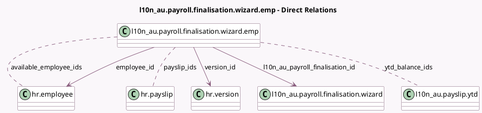

<!-- GENERATED:MODEL -->
---
tags: [odoo, enterprise, generated, model]
---

# l10n_au.payroll.finalisation.wizard.emp

- Module: [[docs/Enterprise Addons/l10n_au_hr_payroll_account/l10n_au_hr_payroll_account|l10n_au_hr_payroll_account]]
- Scope: Enterprise Addons
- Defined in module: yes
- Source files: `wizard/l10n_au_payroll_finalisation.py`
- Python classes: `L10n_AuPayrollFinalisationWizardEmp`
- Description: STP Finalisation Employees

## Field footprint

- Detected fields: 10
- Field types: `Boolean` x 1, `Date` x 2, `Many2many` x 3, `Many2one` x 4
- Relation fields: 7

## Sample fields

- `available_employee_ids`: `Many2many` (comodel `hr.employee`, compute `_compute_available_employees`)
- `company_id`: `Many2one` (related `l10n_au_payroll_finalisation_id.company_id`, store `True`)
- `contract_active`: `Boolean` (comodel `Active`, related `employee_id.active`)
- `contract_end_date`: `Date` (comodel `Contract End Date`, related `version_id.contract_date_end`)
- `contract_start_date`: `Date` (comodel `Contract Start Date`, related `version_id.contract_date_start`)
- `employee_id`: `Many2one` (comodel `hr.employee`)
- `l10n_au_payroll_finalisation_id`: `Many2one` (comodel `l10n_au.payroll.finalisation.wizard`)
- `payslip_ids`: `Many2many` (comodel `hr.payslip`, compute `_compute_amounts_to_report`)
- `version_id`: `Many2one` (comodel `hr.version`, related `employee_id.version_id`)
- `ytd_balance_ids`: `Many2many` (comodel `l10n_au.payslip.ytd`, compute `_compute_amounts_to_report`)

## Method hints

- Detected methods: 3
- Action methods: none
- Compute methods: `_compute_amounts_to_report`, `_compute_available_employees`
- Onchange methods: none

## Direct relation diagram

## Navigation

- **Parent:** [[docs/Enterprise Addons/l10n_au_hr_payroll_account/Models]]

<!-- GENERATED:MODEL -->
