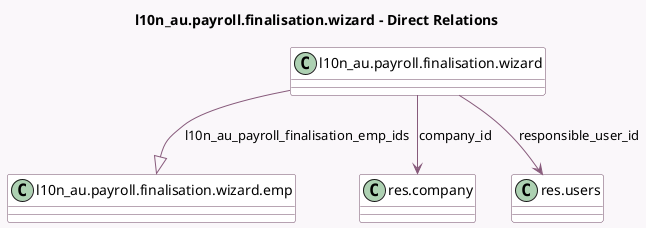

<!-- GENERATED:MODEL -->
---
tags: [odoo, enterprise, generated, model]
---

# l10n_au.payroll.finalisation.wizard

- Module: [[docs/Enterprise Addons/l10n_au_hr_payroll_account/l10n_au_hr_payroll_account|l10n_au_hr_payroll_account]]
- Scope: Enterprise Addons
- Defined in module: yes
- Source files: `wizard/l10n_au_payroll_finalisation.py`
- Python classes: `L10n_AuPayrollFinalisationWizard`
- Description: STP Finalisation

## Field footprint

- Detected fields: 13
- Field types: `Boolean` x 2, `Char` x 4, `Date` x 3, `Many2one` x 2, `One2many` x 1, `Selection` x 1
- Relation fields: 3

## Sample fields

- `abn`: `Char` (comodel `ABN`, related `company_id.vat`)
- `bms_id`: `Char` (related `company_id.l10n_au_bms_id`)
- `branch_code`: `Char` (related `company_id.l10n_au_branch_code`)
- `company_id`: `Many2one` (comodel `res.company`)
- `date_deadline`: `Date` (comodel `Deadline Date`)
- `date_end`: `Date` (comodel `Date End`, compute `_compute_date_period`)
- `date_start`: `Date` (comodel `Date Start`, compute `_compute_date_period`)
- `finalisation`: `Boolean` (comodel `Finalisation`)
- `fiscal_year`: `Selection`
- `is_eofy`: `Boolean` (comodel `EOFY Declaration`)
- `l10n_au_payroll_finalisation_emp_ids`: `One2many` (comodel `l10n_au.payroll.finalisation.wizard.emp`, compute `_compute_all_employees`, store `True`)
- `name`: `Char` (comodel `Name`, compute `_compute_name`)
- `responsible_user_id`: `Many2one` (comodel `res.users`)

## Method hints

- Detected methods: 8
- Action methods: none
- Compute methods: `_compute_all_employees`, `_compute_date_period`, `_compute_name`
- Onchange methods: none

## Direct relation diagram

## Navigation

- **Parent:** [[docs/Enterprise Addons/l10n_au_hr_payroll_account/Models]]

<!-- GENERATED:MODEL -->
