<!-- GENERATED:MODEL -->
---
tags: [odoo, enterprise, generated, model]
---

# l10n_au.payslip.ytd.input

- Module: [[docs/Enterprise Addons/l10n_au_hr_payroll_account/l10n_au_hr_payroll_account|l10n_au_hr_payroll_account]]
- Scope: Enterprise Addons
- Defined in module: yes
- Source files: `models/l10n_au_payslip_ytd.py`
- Python classes: `L10nAUPayslipYTDInput`
- Description: YTD Opening Balances Inputs

## Field footprint

- Detected fields: 6
- Field types: `Char` x 1, `Float` x 1, `Many2one` x 2, `Many2oneReference` x 1, `Selection` x 1
- Relation fields: 2

## Sample fields

- `employee_id`: `Many2one` (related `l10n_au_payslip_ytd_id.employee_id`)
- `l10n_au_payslip_ytd_id`: `Many2one` (comodel `l10n_au.payslip.ytd`)
- `name`: `Char` (compute `_compute_name`, store `True`)
- `res_id`: `Many2oneReference` (comodel `Input`)
- `res_model`: `Selection`
- `ytd_amount`: `Float`

## Method hints

- Detected methods: 4
- Action methods: none
- Compute methods: `_compute_name`
- Onchange methods: none

## Direct relation diagram

```plantuml
@startuml
!define ODOO_COLOR_PRIMARY #714B67
!define ODOO_COLOR_ACCENT #875A7B
!define ODOO_COLOR_BG #FAF7FA

skinparam backgroundColor ODOO_COLOR_BG
skinparam defaultTextAlignment left
skinparam ArrowColor ODOO_COLOR_ACCENT
skinparam ClassBackgroundColor white
skinparam ClassBorderColor ODOO_COLOR_PRIMARY
skinparam ComponentBackgroundColor white
skinparam ComponentBorderColor ODOO_COLOR_PRIMARY
skinparam NoteBackgroundColor #FFF8FF
skinparam NoteBorderColor ODOO_COLOR_ACCENT
skinparam SequenceLifeLineBorderColor ODOO_COLOR_ACCENT
skinparam SequenceLifeLineBackgroundColor #FFFFFF
skinparam SequenceParticipantBorderColor ODOO_COLOR_PRIMARY
skinparam SequenceParticipantBackgroundColor #FFFFFF
skinparam sequence {
  ArrowColor ODOO_COLOR_ACCENT
  ActorBorderColor ODOO_COLOR_PRIMARY
}
title l10n_au.payslip.ytd.input - Direct Relations
class "l10n_au.payslip.ytd.input" as l10n_au_payslip_ytd_input
class "l10n_au.payslip.ytd" as l10n_au_payslip_ytd
l10n_au_payslip_ytd_input --> l10n_au_payslip_ytd : l10n_au_payslip_ytd_id
@enduml
```

## Navigation

- **Parent:** [[docs/Enterprise Addons/l10n_au_hr_payroll_account/Models]]

<!-- GENERATED:MODEL -->
