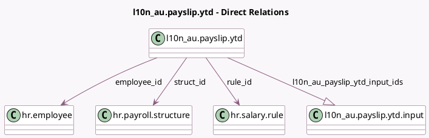

<!-- GENERATED:MODEL -->
---
tags: [odoo, enterprise, generated, model]
---

# l10n_au.payslip.ytd

- Module: [[docs/Enterprise Addons/l10n_au_hr_payroll_account/l10n_au_hr_payroll_account|l10n_au_hr_payroll_account]]
- Scope: Enterprise Addons
- Defined in module: yes
- Source files: `models/l10n_au_payslip_ytd.py`
- Python classes: `L10n_AuPayslipYtd`
- Description: YTD Opening Balances

## Field footprint

- Detected fields: 14
- Field types: `Boolean` x 2, `Char` x 2, `Date` x 1, `Float` x 1, `Many2one` x 5, `Monetary` x 1, `One2many` x 1, `Selection` x 1
- Relation fields: 6

## Sample fields

- `code`: `Char` (related `rule_id.code`)
- `company_id`: `Many2one` (related `employee_id.company_id`)
- `currency_id`: `Many2one` (related `company_id.currency_id`)
- `employee_id`: `Many2one` (comodel `hr.employee`)
- `finalised`: `Boolean`
- `l10n_au_income_stream_type`: `Selection`
- `l10n_au_payslip_ytd_input_ids`: `One2many` (comodel `l10n_au.payslip.ytd.input`)
- `name`: `Char` (compute `_compute_name`)
- `requires_inputs`: `Boolean` (comodel `Requires Inputs`)
- `rule_id`: `Many2one` (comodel `hr.salary.rule`)
- `start_date`: `Date`
- `start_value`: `Monetary`
- `struct_id`: `Many2one` (comodel `hr.payroll.structure`, compute `_compute_struct_id`, store `True`)
- `ytd_amount`: `Float` (compute `_compute_total_ytd`)

## Method hints

- Detected methods: 12
- Action methods: `action_add_inputs`
- Compute methods: `_compute_name`, `_compute_struct_id`, `_compute_total_ytd`
- Onchange methods: none

## Direct relation diagram

## Navigation

- **Parent:** [[docs/Enterprise Addons/l10n_au_hr_payroll_account/Models]]

<!-- GENERATED:MODEL -->
