<!-- GENERATED:MODEL -->
---
tags: [odoo, enterprise, generated, model]
---

# l10n_au.previous.payroll.transfer.employee

- Module: [[docs/Enterprise Addons/l10n_au_hr_payroll_account/l10n_au_hr_payroll_account|l10n_au_hr_payroll_account]]
- Scope: Enterprise Addons
- Defined in module: yes
- Source files: `wizard/l10n_au_previous_payroll_transfer.py`
- Python classes: `L10n_AuPreviousPayrollTransferEmployee`
- Description: Employee Transfer From Previous Payroll System

## Field footprint

- Detected fields: 5
- Field types: `Char` x 1, `Many2one` x 3, `Selection` x 1
- Relation fields: 3

## Sample fields

- `company_id`: `Many2one` (related `l10n_au_previous_payroll_transfer_id.company_id`)
- `employee_id`: `Many2one` (comodel `hr.employee`)
- `l10n_au_income_stream_type`: `Selection` (compute `_compute_income_stream_type`, store `True`)
- `l10n_au_previous_payroll_transfer_id`: `Many2one` (comodel `l10n_au.previous.payroll.transfer`)
- `previous_payroll_id`: `Char` (comodel `Previous Payroll ID`, compute `_compute_payroll_id`, store `True`)

## Method hints

- Detected methods: 2
- Action methods: none
- Compute methods: `_compute_income_stream_type`, `_compute_payroll_id`
- Onchange methods: none

## Direct relation diagram

```plantuml
@startuml
!define ODOO_COLOR_PRIMARY #714B67
!define ODOO_COLOR_ACCENT #875A7B
!define ODOO_COLOR_BG #FAF7FA

skinparam backgroundColor ODOO_COLOR_BG
skinparam defaultTextAlignment left
skinparam ArrowColor ODOO_COLOR_ACCENT
skinparam ClassBackgroundColor white
skinparam ClassBorderColor ODOO_COLOR_PRIMARY
skinparam ComponentBackgroundColor white
skinparam ComponentBorderColor ODOO_COLOR_PRIMARY
skinparam NoteBackgroundColor #FFF8FF
skinparam NoteBorderColor ODOO_COLOR_ACCENT
skinparam SequenceLifeLineBorderColor ODOO_COLOR_ACCENT
skinparam SequenceLifeLineBackgroundColor #FFFFFF
skinparam SequenceParticipantBorderColor ODOO_COLOR_PRIMARY
skinparam SequenceParticipantBackgroundColor #FFFFFF
skinparam sequence {
  ArrowColor ODOO_COLOR_ACCENT
  ActorBorderColor ODOO_COLOR_PRIMARY
}
title l10n_au.previous.payroll.transfer.employee - Direct Relations
class "l10n_au.previous.payroll.transfer.employee" as l10n_au_previous_payroll_transfer_employee
class "hr.employee" as hr_employee
class "l10n_au.previous.payroll.transfer" as l10n_au_previous_payroll_transfer
l10n_au_previous_payroll_transfer_employee --> l10n_au_previous_payroll_transfer : l10n_au_previous_payroll_transfer_id
l10n_au_previous_payroll_transfer_employee --> hr_employee : employee_id
@enduml
```

## Navigation

- **Parent:** [[docs/Enterprise Addons/l10n_au_hr_payroll_account/Models]]

<!-- GENERATED:MODEL -->
