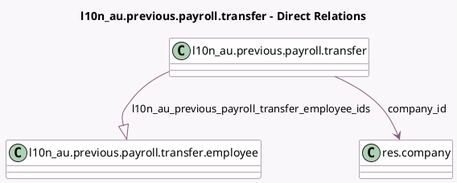

<!-- GENERATED:MODEL -->
---
tags: [odoo, enterprise, generated, model]
---

# l10n_au.previous.payroll.transfer

- Module: [[docs/Enterprise Addons/l10n_au_hr_payroll_account/l10n_au_hr_payroll_account|l10n_au_hr_payroll_account]]
- Scope: Enterprise Addons
- Defined in module: yes
- Source files: `wizard/l10n_au_previous_payroll_transfer.py`
- Python classes: `L10n_AuPreviousPayrollTransfer`
- Description: Transfer From Previous Payroll System

## Field footprint

- Detected fields: 4
- Field types: `Char` x 1, `Date` x 1, `Many2one` x 1, `One2many` x 1
- Relation fields: 2

## Sample fields

- `company_id`: `Many2one` (comodel `res.company`)
- `fiscal_year_start_date`: `Date`
- `l10n_au_previous_payroll_transfer_employee_ids`: `One2many` (comodel `l10n_au.previous.payroll.transfer.employee`, compute `_compute_all_employees`, store `True`)
- `previous_bms_id`: `Char`

## Method hints

- Detected methods: 4
- Action methods: `action_transfer`
- Compute methods: `_compute_all_employees`
- Onchange methods: none

## Direct relation diagram

## Navigation

- **Parent:** [[docs/Enterprise Addons/l10n_au_hr_payroll_account/Models]]

<!-- GENERATED:MODEL -->
