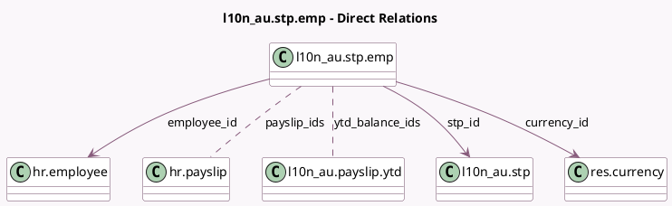

<!-- GENERATED:MODEL -->
---
tags: [odoo, enterprise, generated, model]
---

# l10n_au.stp.emp

- Module: [[docs/Enterprise Addons/l10n_au_hr_payroll_account/l10n_au_hr_payroll_account|l10n_au_hr_payroll_account]]
- Scope: Enterprise Addons
- Defined in module: yes
- Source files: `models/l10n_au_stp_emp.py`
- Python classes: `L10n_AuStpEmp`
- Description: STP Employee

## Field footprint

- Detected fields: 10
- Field types: `Many2many` x 2, `Many2one` x 3, `Monetary` x 5
- Relation fields: 5

## Sample fields

- `currency_id`: `Many2one` (comodel `res.currency`, related `stp_id.currency_id`)
- `employee_id`: `Many2one` (comodel `hr.employee`)
- `payslip_ids`: `Many2many` (comodel `hr.payslip`, compute `_compute_ytd`)
- `stp_id`: `Many2one` (comodel `l10n_au.stp`)
- `ytd_balance_ids`: `Many2many` (comodel `l10n_au.payslip.ytd`, compute `_compute_ytd`)
- `ytd_gross`: `Monetary` (comodel `Total Gross`, compute `_compute_ytd`)
- `ytd_rfba`: `Monetary` (comodel `Total RFBA`, compute `_compute_ytd`)
- `ytd_rfbae`: `Monetary` (comodel `Total RFBA-E`, compute `_compute_ytd`)
- `ytd_super`: `Monetary` (comodel `Total Super`, compute `_compute_ytd`)
- `ytd_tax`: `Monetary` (comodel `Total Tax`, compute `_compute_ytd`)

## Method hints

- Detected methods: 1
- Action methods: none
- Compute methods: `_compute_ytd`
- Onchange methods: none

## Direct relation diagram

## Navigation

- **Parent:** [[docs/Enterprise Addons/l10n_au_hr_payroll_account/Models]]

<!-- GENERATED:MODEL -->
