<!-- GENERATED:MODEL -->
---
tags: [odoo, enterprise, generated, model]
---

# l10n_au.stp.ffr.wizard

- Module: [[docs/Enterprise Addons/l10n_au_hr_payroll_account/l10n_au_hr_payroll_account|l10n_au_hr_payroll_account]]
- Scope: Enterprise Addons
- Defined in module: yes
- Source files: `wizard/l10n_au_stp_ffr.py`
- Python classes: `L10n_AuStpFfrWizard`
- Description: STP Full File Replacement Wizard

## Field footprint

- Detected fields: 2
- Field types: `Many2one` x 1, `One2many` x 1
- Relation fields: 2

## Sample fields

- `ffr_payslip_ids`: `One2many` (comodel `l10n_au.stp.ffr.payslip`)
- `stp_id`: `Many2one` (comodel `l10n_au.stp`)

## Method hints

- Detected methods: 3
- Action methods: `action_create_ffr`
- Compute methods: none
- Onchange methods: none

## Direct relation diagram

```plantuml
@startuml
!define ODOO_COLOR_PRIMARY #714B67
!define ODOO_COLOR_ACCENT #875A7B
!define ODOO_COLOR_BG #FAF7FA

skinparam backgroundColor ODOO_COLOR_BG
skinparam defaultTextAlignment left
skinparam ArrowColor ODOO_COLOR_ACCENT
skinparam ClassBackgroundColor white
skinparam ClassBorderColor ODOO_COLOR_PRIMARY
skinparam ComponentBackgroundColor white
skinparam ComponentBorderColor ODOO_COLOR_PRIMARY
skinparam NoteBackgroundColor #FFF8FF
skinparam NoteBorderColor ODOO_COLOR_ACCENT
skinparam SequenceLifeLineBorderColor ODOO_COLOR_ACCENT
skinparam SequenceLifeLineBackgroundColor #FFFFFF
skinparam SequenceParticipantBorderColor ODOO_COLOR_PRIMARY
skinparam SequenceParticipantBackgroundColor #FFFFFF
skinparam sequence {
  ArrowColor ODOO_COLOR_ACCENT
  ActorBorderColor ODOO_COLOR_PRIMARY
}
title l10n_au.stp.ffr.wizard - Direct Relations
class "l10n_au.stp.ffr.wizard" as l10n_au_stp_ffr_wizard
class "l10n_au.stp" as l10n_au_stp
class "l10n_au.stp.ffr.payslip" as l10n_au_stp_ffr_payslip
l10n_au_stp_ffr_wizard --> l10n_au_stp : stp_id
l10n_au_stp_ffr_wizard --|> l10n_au_stp_ffr_payslip : ffr_payslip_ids
@enduml
```

## Navigation

- **Parent:** [[docs/Enterprise Addons/l10n_au_hr_payroll_account/Models]]

<!-- GENERATED:MODEL -->
