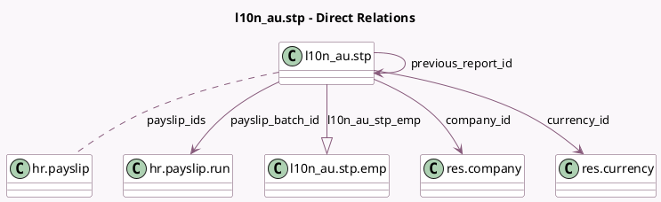

<!-- GENERATED:MODEL -->
---
tags: [odoo, enterprise, generated, model]
---

# l10n_au.stp

- Module: [[docs/Enterprise Addons/l10n_au_hr_payroll_account/l10n_au_hr_payroll_account|l10n_au_hr_payroll_account]]
- Scope: Enterprise Addons
- Defined in module: yes
- Source files: `models/l10n_au_stp.py`
- Python classes: `L10n_AuStp`
- Description: Single Touch Payroll
- Inherits: `mail.activity.mixin`, `mail.thread`

## Field footprint

- Detected fields: 27
- Field types: `Binary` x 1, `Boolean` x 8, `Char` x 5, `Date` x 3, `Many2many` x 1, `Many2one` x 4, `One2many` x 1, `Selection` x 3, `Text` x 1
- Relation fields: 6

## Sample fields

- `company_id`: `Many2one` (comodel `res.company`)
- `currency_id`: `Many2one` (comodel `res.currency`, compute `_compute_currency_id`)
- `end_date`: `Date` (comodel `End Date`, compute `_compute_end_date`, store `True`)
- `error_message`: `Text` (comodel `Error Message`)
- `ffr`: `Boolean`
- `file_replacement_message`: `Char` (compute `_compute_file_replacement_message`)
- `is_finalisation`: `Boolean`
- `is_latest`: `Boolean` (comodel `Is Latest`, compute `_compute_is_latest`, store `False`)
- `is_not_paid`: `Boolean` (compute `_compute_is_not_paid`)
- `is_opening_balances`: `Boolean`
- `is_replaced`: `Boolean` (comodel `Is Replaced`)
- `is_unfinalisation`: `Boolean`
- `is_zeroing`: `Boolean` (comodel `Zero Out YTD`)
- `l10n_au_stp_emp`: `One2many` (comodel `l10n_au.stp.emp`)
- `name`: `Char` (compute `_compute_name`, store `True`)
- `payevent_type`: `Selection`
- `payslip_batch_id`: `Many2one` (comodel `hr.payslip.run`)
- `payslip_ids`: `Many2many` (comodel `hr.payslip`)
- `previous_report_id`: `Many2one` (comodel `l10n_au.stp`)
- `start_date`: `Date` (comodel `Start Date`)

## Method hints

- Detected methods: 27
- Action methods: `action_generate_xml`, `action_replace_file`
- Compute methods: `_compute_currency_id`, `_compute_end_date`, `_compute_file_replacement_message`, `_compute_is_latest`, `_compute_is_not_paid`, `_compute_name`, `_compute_submit_date`, `_compute_warning_message`
- Onchange methods: none

## Direct relation diagram

## Navigation

- **Parent:** [[docs/Enterprise Addons/l10n_au_hr_payroll_account/Models]]

<!-- GENERATED:MODEL -->
