<!-- GENERATED:MODEL -->
---
tags: [odoo, enterprise, generated, model]
---

# l10n_au.stp.submit

- Module: [[docs/Enterprise Addons/l10n_au_hr_payroll_account/l10n_au_hr_payroll_account|l10n_au_hr_payroll_account]]
- Scope: Enterprise Addons
- Defined in module: yes
- Source files: `wizard/l10n_au_stp_submit.py`
- Python classes: `L10n_AuStpSubmit`
- Description: Submit STP Report

## Field footprint

- Detected fields: 4
- Field types: `Boolean` x 1, `Html` x 2, `Many2one` x 1
- Relation fields: 1

## Sample fields

- `l10n_au_stp_id`: `Many2one` (comodel `l10n_au.stp`)
- `stp_terms`: `Boolean`
- `terms`: `Html` (compute `_compute_terms`)
- `terms_header`: `Html` (compute `_compute_terms`)

## Method hints

- Detected methods: 2
- Action methods: `action_submit`
- Compute methods: `_compute_terms`
- Onchange methods: none

## Direct relation diagram

```plantuml
@startuml
!define ODOO_COLOR_PRIMARY #714B67
!define ODOO_COLOR_ACCENT #875A7B
!define ODOO_COLOR_BG #FAF7FA

skinparam backgroundColor ODOO_COLOR_BG
skinparam defaultTextAlignment left
skinparam ArrowColor ODOO_COLOR_ACCENT
skinparam ClassBackgroundColor white
skinparam ClassBorderColor ODOO_COLOR_PRIMARY
skinparam ComponentBackgroundColor white
skinparam ComponentBorderColor ODOO_COLOR_PRIMARY
skinparam NoteBackgroundColor #FFF8FF
skinparam NoteBorderColor ODOO_COLOR_ACCENT
skinparam SequenceLifeLineBorderColor ODOO_COLOR_ACCENT
skinparam SequenceLifeLineBackgroundColor #FFFFFF
skinparam SequenceParticipantBorderColor ODOO_COLOR_PRIMARY
skinparam SequenceParticipantBackgroundColor #FFFFFF
skinparam sequence {
  ArrowColor ODOO_COLOR_ACCENT
  ActorBorderColor ODOO_COLOR_PRIMARY
}
title l10n_au.stp.submit - Direct Relations
class "l10n_au.stp.submit" as l10n_au_stp_submit
class "l10n_au.stp" as l10n_au_stp
l10n_au_stp_submit --> l10n_au_stp : l10n_au_stp_id
@enduml
```

## Navigation

- **Parent:** [[docs/Enterprise Addons/l10n_au_hr_payroll_account/Models]]

<!-- GENERATED:MODEL -->
