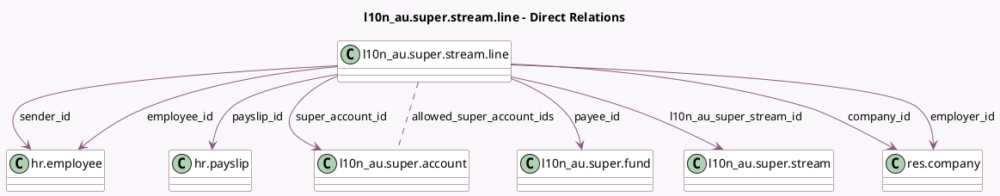

<!-- GENERATED:MODEL -->
---
tags: [odoo, enterprise, generated, model]
---

# l10n_au.super.stream.line

- Module: [[docs/Enterprise Addons/l10n_au_hr_payroll_account/l10n_au_hr_payroll_account|l10n_au_hr_payroll_account]]
- Scope: Enterprise Addons
- Defined in module: yes
- Source files: `models/l10n_au_super_stream.py`
- Python classes: `L10n_AuSuperStreamLine`
- Description: Super Contribution Line

## Field footprint

- Detected fields: 39
- Field types: `Boolean` x 1, `Char` x 4, `Date` x 8, `Float` x 2, `Many2many` x 1, `Many2one` x 9, `Monetary` x 12, `Selection` x 2
- Relation fields: 10

## Sample fields

- `allowed_super_account_ids`: `Many2many` (comodel `l10n_au.super.account`, compute `_compute_allowed_super_account_ids`)
- `amount_total`: `Monetary` (comodel `Total Contribution`, compute `_compute_amount_total`)
- `annual_salary_for_benefits_amount`: `Monetary`
- `annual_salary_for_contributions_amount`: `Monetary`
- `annual_salary_for_contributions_effective_end_date`: `Date`
- `annual_salary_for_contributions_effective_start_date`: `Date`
- `annual_salary_for_insurance_amount`: `Monetary`
- `award_or_productivity_amount`: `Monetary` (compute `_compute_payslip_fields`, store `True`)
- `benefit_category_text`: `Char`
- `child_contributions_amount`: `Monetary`
- `company_id`: `Many2one` (comodel `res.company`, related `l10n_au_super_stream_id.company_id`)
- `currency_id`: `Many2one` (related `l10n_au_super_stream_id.currency_id`)
- `employee_id`: `Many2one` (comodel `hr.employee`)
- `employer_id`: `Many2one` (comodel `res.company`, related `l10n_au_super_stream_id.company_id`)
- `employment_start_date`: `Date` (related `payslip_id.version_id.contract_date_start`, store `True`)
- `employment_status_code`: `Selection`
- `end_date`: `Date` (comodel `Period End Date`, related `payslip_id.date_to`)
- `fund_registration_date`: `Date`
- `insurance_opt_out_indicator`: `Boolean`
- `l10n_au_super_stream_id`: `Many2one` (comodel `l10n_au.super.stream`)

## Method hints

- Detected methods: 8
- Action methods: none
- Compute methods: `_compute_allowed_super_account_ids`, `_compute_amount_total`, `_compute_name`, `_compute_payslip_fields`
- Onchange methods: none

## Direct relation diagram

## Navigation

- **Parent:** [[docs/Enterprise Addons/l10n_au_hr_payroll_account/Models]]

<!-- GENERATED:MODEL -->
