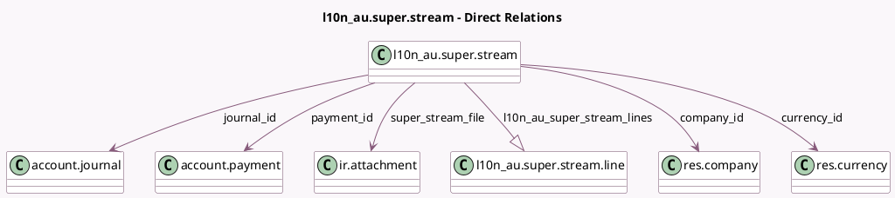

<!-- GENERATED:MODEL -->
---
tags: [odoo, enterprise, generated, model]
---

# l10n_au.super.stream

- Module: [[docs/Enterprise Addons/l10n_au_hr_payroll_account/l10n_au_hr_payroll_account|l10n_au_hr_payroll_account]]
- Scope: Enterprise Addons
- Defined in module: yes
- Source files: `models/l10n_au_super_stream.py`
- Python classes: `L10n_auSuperStream`
- Description: Super Contributions
- Inherits: `mail.activity.mixin`, `mail.thread`

## Field footprint

- Detected fields: 15
- Field types: `Char` x 5, `Datetime` x 1, `Many2one` x 5, `Monetary` x 1, `One2many` x 1, `Selection` x 2
- Relation fields: 6

## Sample fields

- `amount_total`: `Monetary` (compute `_compute_amount_total`)
- `company_id`: `Many2one` (comodel `res.company`)
- `currency_id`: `Many2one` (comodel `res.currency`)
- `file_id`: `Char` (comodel `File ID`)
- `file_version`: `Char`
- `journal_id`: `Many2one` (comodel `account.journal`)
- `l10n_au_super_stream_lines`: `One2many` (comodel `l10n_au.super.stream.line`)
- `name`: `Char`
- `paid_date`: `Datetime`
- `payment_id`: `Many2one` (comodel `account.payment`)
- `source_entity_id`: `Char` (comodel `Source Entity ID`, compute `_compute_sid`)
- `source_entity_id_type`: `Selection`
- `state`: `Selection`
- `super_stream_file`: `Many2one` (comodel `ir.attachment`)
- `vat`: `Char` (related `company_id.vat`)

## Method hints

- Detected methods: 18
- Action methods: `action_confirm`, `action_draft`, `action_open_payment`, `action_register_super_payment`
- Compute methods: `_compute_amount_total`, `_compute_sid`
- Onchange methods: none

## Direct relation diagram

## Navigation

- **Parent:** [[docs/Enterprise Addons/l10n_au_hr_payroll_account/Models]]

<!-- GENERATED:MODEL -->
