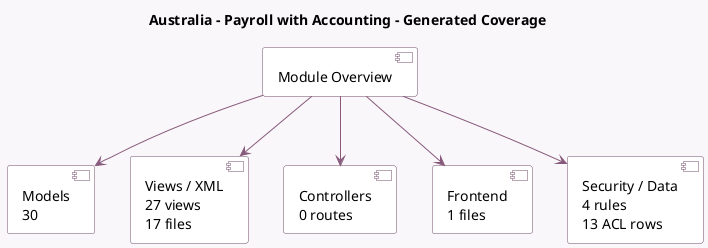

<!-- GENERATED:MODULE -->
---
tags: [odoo, enterprise, module]
---

# Australia - Payroll with Accounting

- Scope: Enterprise Addons
- Source: enterprise/l10n_au_hr_payroll_account
- Dependencies: [[docs/Enterprise Addons/l10n_au_hr_payroll/l10n_au_hr_payroll|l10n_au_hr_payroll]], [[docs/Enterprise Addons/hr_payroll_account/hr_payroll_account|hr_payroll_account]], [[docs/Community Addons/l10n_au/l10n_au|l10n_au]], [[docs/Enterprise Addons/l10n_au_aba/l10n_au_aba|l10n_au_aba]]

## Generated coverage

- Models: 30
- XML files with UI/data artifacts: 17
- Views: 27
- Actions: 7
- Menus: 4
- Rules (ir.rule): 4
- Access CSV entries: 13
- Controller units: 0
- Frontend asset files: 1

## Module map

## Detail notes

- Models: [[docs/Enterprise Addons/l10n_au_hr_payroll_account/Models|Models]] (30)
- Views and XML: [[docs/Enterprise Addons/l10n_au_hr_payroll_account/Views|Views]] (17 files)
- Frontend: [[docs/Enterprise Addons/l10n_au_hr_payroll_account/Frontend|Frontend]] (1 files)

## Key models

- `account.batch.payment`
- `account.chart.template`
- `account.journal`
- `account.payment`
- `account.payment.method`
- `account.payment.register`
- `account.return`
- `hr.employee`
- `hr.payroll.payment.report.wizard`
- `hr.payslip`
- `hr.payslip.line`
- `hr.payslip.run`

## Navigation

- [[../Enterprise Addons/Enterprise Addons|Back to scope]]
- [[../../docs/docs|Back to docs]]

<!-- GENERATED:MODULE -->

