<!-- GENERATED:MODEL -->
---
tags: [odoo, enterprise, generated, model]
---

# l10n_au.employer.registration

- Module: [[docs/Enterprise Addons/l10n_au_hr_payroll_api/l10n_au_hr_payroll_api|l10n_au_hr_payroll_api]]
- Scope: Enterprise Addons
- Defined in module: yes
- Source files: `models/l10n_au_employer_registration.py`
- Python classes: `EmployerRegistration`
- Description: Employer Registration
- Inherits: `mail.thread`

## Field footprint

- Detected fields: 6
- Field types: `Boolean` x 2, `Json` x 1, `Many2one` x 1, `Selection` x 2
- Relation fields: 1

## Sample fields

- `company_id`: `Many2one` (comodel `res.company`)
- `odoo_disclaimer_check`: `Boolean` (compute `_compute_authorisation_checks`)
- `registration_fields`: `Json`
- `registration_mode`: `Selection`
- `status`: `Selection`
- `superchoice_dda_check`: `Boolean` (compute `_compute_authorisation_checks`)

## Method hints

- Detected methods: 6
- Action methods: `action_confirm`
- Compute methods: `_compute_authorisation_checks`, `_compute_display_name`
- Onchange methods: none

## Direct relation diagram

```plantuml
@startuml
!define ODOO_COLOR_PRIMARY #714B67
!define ODOO_COLOR_ACCENT #875A7B
!define ODOO_COLOR_BG #FAF7FA

skinparam backgroundColor ODOO_COLOR_BG
skinparam defaultTextAlignment left
skinparam ArrowColor ODOO_COLOR_ACCENT
skinparam ClassBackgroundColor white
skinparam ClassBorderColor ODOO_COLOR_PRIMARY
skinparam ComponentBackgroundColor white
skinparam ComponentBorderColor ODOO_COLOR_PRIMARY
skinparam NoteBackgroundColor #FFF8FF
skinparam NoteBorderColor ODOO_COLOR_ACCENT
skinparam SequenceLifeLineBorderColor ODOO_COLOR_ACCENT
skinparam SequenceLifeLineBackgroundColor #FFFFFF
skinparam SequenceParticipantBorderColor ODOO_COLOR_PRIMARY
skinparam SequenceParticipantBackgroundColor #FFFFFF
skinparam sequence {
  ArrowColor ODOO_COLOR_ACCENT
  ActorBorderColor ODOO_COLOR_PRIMARY
}
title l10n_au.employer.registration - Direct Relations
class "l10n_au.employer.registration" as l10n_au_employer_registration
class "res.company" as res_company
l10n_au_employer_registration --> res_company : company_id
@enduml
```

## Navigation

- **Parent:** [[docs/Enterprise Addons/l10n_au_hr_payroll_api/Models]]

<!-- GENERATED:MODEL -->
