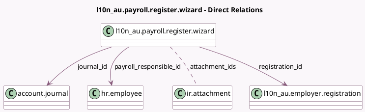

<!-- GENERATED:MODEL -->
---
tags: [odoo, enterprise, generated, model]
---

# l10n_au.payroll.register.wizard

- Module: [[docs/Enterprise Addons/l10n_au_hr_payroll_api/l10n_au_hr_payroll_api|l10n_au_hr_payroll_api]]
- Scope: Enterprise Addons
- Defined in module: yes
- Source files: `wizard/l10n_au_payroll_register.py`
- Python classes: `L10n_AuPayrollRegister`
- Description: Payroll Onboarding

## Field footprint

- Detected fields: 29
- Field types: `Boolean` x 2, `Char` x 15, `Json` x 2, `Many2many` x 1, `Many2one` x 6, `Selection` x 3
- Relation fields: 7

## Sample fields

- `abn`: `Char` (related `company_id.vat`)
- `attachment_ids`: `Many2many` (comodel `ir.attachment`, compute `_compute_attachment_ids`)
- `authorised`: `Selection` (compute `_compute_payroll_fields`, store `False`)
- `bank_account_bsb`: `Char` (related `journal_id.aba_bsb`)
- `bank_account_name`: `Char` (related `journal_id.company_partner_id.name`)
- `bank_account_number`: `Char` (related `journal_id.bank_acc_number`)
- `bank_name`: `Char` (related `journal_id.bank_id.name`)
- `city`: `Char` (related `company_id.city`)
- `company_id`: `Many2one` (related `registration_id.company_id`)
- `company_name`: `Char` (related `company_id.name`)
- `country_id`: `Many2one` (related `company_id.country_id`)
- `documents_to_sign`: `Json`
- `journal_id`: `Many2one` (comodel `account.journal`)
- `odoo_disclaimer_check`: `Boolean`
- `payroll_mode`: `Selection` (related `company_id.l10n_au_payroll_mode`)
- `payroll_responsible_email`: `Char` (related `payroll_responsible_id.work_email`)
- `payroll_responsible_id`: `Many2one` (comodel `hr.employee`, compute `_compute_payroll_fields`)
- `payroll_responsible_phone`: `Char` (related `payroll_responsible_id.work_phone`)
- `payroll_responsible_position`: `Char` (related `payroll_responsible_id.job_title`)
- `phone`: `Char` (related `company_id.phone`)

## Method hints

- Detected methods: 11
- Action methods: `action_back`, `action_next`
- Compute methods: `_compute_attachment_ids`, `_compute_payroll_fields`
- Onchange methods: none

## Direct relation diagram

## Navigation

- **Parent:** [[docs/Enterprise Addons/l10n_au_hr_payroll_api/Models]]

<!-- GENERATED:MODEL -->
