<!-- GENERATED:MODEL -->
---
tags: [odoo, enterprise, generated, model]
---

# l10n_au.superstream.cancel

- Module: [[docs/Enterprise Addons/l10n_au_hr_payroll_api/l10n_au_hr_payroll_api|l10n_au_hr_payroll_api]]
- Scope: Enterprise Addons
- Defined in module: yes
- Source files: `wizard/l10n_au_superstream_cancel.py`
- Python classes: `L10n_AuSuperStreamCancel`
- Description: Cancel SuperStream

## Field footprint

- Detected fields: 2
- Field types: `Many2one` x 1, `Selection` x 1
- Relation fields: 1

## Sample fields

- `l10n_au_cancel_type`: `Selection`
- `l10n_au_super_stream_id`: `Many2one` (comodel `l10n_au.super.stream`)

## Method hints

- Detected methods: 1
- Action methods: `action_cancel`
- Compute methods: none
- Onchange methods: none

## Direct relation diagram

```plantuml
@startuml
!define ODOO_COLOR_PRIMARY #714B67
!define ODOO_COLOR_ACCENT #875A7B
!define ODOO_COLOR_BG #FAF7FA

skinparam backgroundColor ODOO_COLOR_BG
skinparam defaultTextAlignment left
skinparam ArrowColor ODOO_COLOR_ACCENT
skinparam ClassBackgroundColor white
skinparam ClassBorderColor ODOO_COLOR_PRIMARY
skinparam ComponentBackgroundColor white
skinparam ComponentBorderColor ODOO_COLOR_PRIMARY
skinparam NoteBackgroundColor #FFF8FF
skinparam NoteBorderColor ODOO_COLOR_ACCENT
skinparam SequenceLifeLineBorderColor ODOO_COLOR_ACCENT
skinparam SequenceLifeLineBackgroundColor #FFFFFF
skinparam SequenceParticipantBorderColor ODOO_COLOR_PRIMARY
skinparam SequenceParticipantBackgroundColor #FFFFFF
skinparam sequence {
  ArrowColor ODOO_COLOR_ACCENT
  ActorBorderColor ODOO_COLOR_PRIMARY
}
title l10n_au.superstream.cancel - Direct Relations
class "l10n_au.superstream.cancel" as l10n_au_superstream_cancel
class "l10n_au.super.stream" as l10n_au_super_stream
l10n_au_superstream_cancel --> l10n_au_super_stream : l10n_au_super_stream_id
@enduml
```

## Navigation

- **Parent:** [[docs/Enterprise Addons/l10n_au_hr_payroll_api/Models]]

<!-- GENERATED:MODEL -->
