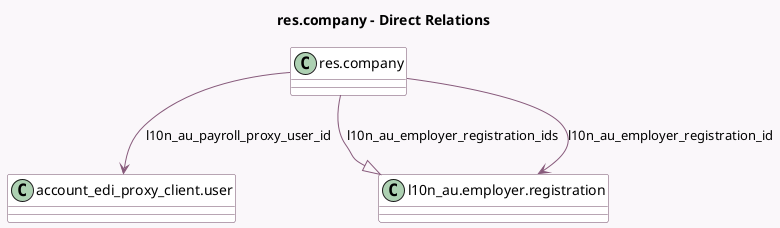

<!-- GENERATED:MODEL -->
---
tags: [odoo, enterprise, generated, model]
---

# res.company

- Module: [[docs/Enterprise Addons/l10n_au_hr_payroll_api/l10n_au_hr_payroll_api|l10n_au_hr_payroll_api]]
- Scope: Enterprise Addons
- Defined in module: yes
- Source files: `models/res_company.py`
- Python classes: `ResCompany`
- Inherits: `l10n_au.audit.logging.mixin`

## Field footprint

- Detected fields: 6
- Field types: `Boolean` x 1, `Many2one` x 2, `One2many` x 1, `Selection` x 2
- Relation fields: 3

## Sample fields

- `l10n_au_abn_valid`: `Boolean` (comodel `ABN Validation State`)
- `l10n_au_employer_registration_id`: `Many2one` (comodel `l10n_au.employer.registration`, compute `_compute_l10n_au_employer_registration_id`, store `True`)
- `l10n_au_employer_registration_ids`: `One2many` (comodel `l10n_au.employer.registration`)
- `l10n_au_payroll_mode`: `Selection`
- `l10n_au_payroll_proxy_user_id`: `Many2one` (comodel `account_edi_proxy_client.user`, compute `_compute_l10n_au_payroll_proxy_user_id`)
- `l10n_au_registration_status`: `Selection` (compute `_compute_l10n_au_employer_registration`)

## Method hints

- Detected methods: 11
- Action methods: `action_check_abn`, `action_view_payroll_onboarding`
- Compute methods: `_compute_l10n_au_employer_registration`, `_compute_l10n_au_employer_registration_id`, `_compute_l10n_au_payroll_proxy_user_id`
- Onchange methods: none

## Direct relation diagram

## Navigation

- **Parent:** [[docs/Enterprise Addons/l10n_au_hr_payroll_api/Models]]

<!-- GENERATED:MODEL -->
