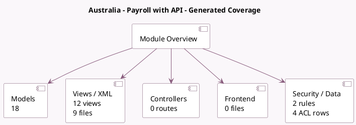

<!-- GENERATED:MODULE -->
---
tags: [odoo, enterprise, module]
---

# Australia - Payroll with API

- Scope: Enterprise Addons
- Source: enterprise/l10n_au_hr_payroll_api
- Dependencies: [[docs/Enterprise Addons/l10n_au_hr_payroll_account/l10n_au_hr_payroll_account|l10n_au_hr_payroll_account]], [[docs/Community Addons/account_edi_proxy_client/account_edi_proxy_client|account_edi_proxy_client]], [[docs/Community Addons/auth_timeout/auth_timeout|auth_timeout]]

## Generated coverage

- Models: 18
- XML files with UI/data artifacts: 9
- Views: 12
- Actions: 1
- Menus: 2
- Rules (ir.rule): 2
- Access CSV entries: 4
- Controller units: 0
- Frontend asset files: 0

## Module map

## Detail notes

- Models: [[docs/Enterprise Addons/l10n_au_hr_payroll_api/Models|Models]] (18)
- Views and XML: [[docs/Enterprise Addons/l10n_au_hr_payroll_api/Views|Views]] (9 files)

## Key models

- `account_edi_proxy_client.user`
- `hr.employee`
- `hr.payslip`
- `ir.attachment`
- `l10n_au.audit.log`
- `l10n_au.audit.logging.mixin`
- `l10n_au.employer.registration`
- `l10n_au.payroll.register.wizard`
- `l10n_au.stp`
- `l10n_au.super.fund`
- `l10n_au.super.stream`
- `l10n_au.super.stream.line`

## Navigation

- [[../Enterprise Addons/Enterprise Addons|Back to scope]]
- [[../../docs/docs|Back to docs]]

<!-- GENERATED:MODULE -->

