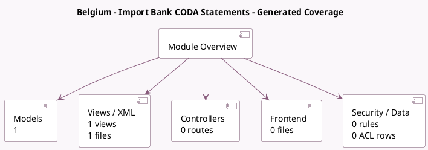

<!-- GENERATED:MODULE -->
---
tags: [odoo, enterprise, module]
---

# Belgium - Import Bank CODA Statements

- Scope: Enterprise Addons
- Source: enterprise/l10n_be_coda
- Dependencies: [[docs/Enterprise Addons/account_accountant/account_accountant|account_accountant]], [[docs/Community Addons/l10n_be/l10n_be|l10n_be]], [[docs/Enterprise Addons/account_bank_statement_import/account_bank_statement_import|account_bank_statement_import]], [[docs/Community Addons/base_iban/base_iban|base_iban]]

## Generated coverage

- Models: 1
- XML files with UI/data artifacts: 1
- Views: 1
- Actions: 0
- Menus: 0
- Rules (ir.rule): 0
- Access CSV entries: 0
- Controller units: 0
- Frontend asset files: 0

## Module map

## Detail notes

- Models: [[docs/Enterprise Addons/l10n_be_coda/Models|Models]] (1)
- Views and XML: [[docs/Enterprise Addons/l10n_be_coda/Views|Views]] (1 files)

## Key models

- `account.journal`

## Navigation

- [[../Enterprise Addons/Enterprise Addons|Back to scope]]
- [[../../docs/docs|Back to docs]]

<!-- GENERATED:MODULE -->

