<!-- GENERATED:MODEL -->
---
tags: [odoo, enterprise, generated, model]
---

# res.config.settings

- Module: [[docs/Enterprise Addons/l10n_be_codabox/l10n_be_codabox|l10n_be_codabox]]
- Scope: Enterprise Addons
- Defined in module: extension only
- Source files: `models/res_config_settings.py`
- Python classes: `ResConfigSettings`

## Field footprint

- Detected fields: 4
- Field types: `Boolean` x 1, `Char` x 2, `Many2one` x 1
- Relation fields: 1

## Sample fields

- `l10n_be_codabox_fiduciary_vat`: `Char` (related `company_id.l10n_be_codabox_fiduciary_vat`)
- `l10n_be_codabox_iap_token`: `Char` (related `company_id.l10n_be_codabox_iap_token`)
- `l10n_be_codabox_is_connected`: `Boolean` (related `company_id.l10n_be_codabox_is_connected`)
- `l10n_be_codabox_soda_journal`: `Many2one` (related `company_id.l10n_be_codabox_soda_journal`)

## Method hints

- Detected methods: 2
- Action methods: none
- Compute methods: none
- Onchange methods: none

## Direct relation diagram

```plantuml
@startuml
!define ODOO_COLOR_PRIMARY #714B67
!define ODOO_COLOR_ACCENT #875A7B
!define ODOO_COLOR_BG #FAF7FA

skinparam backgroundColor ODOO_COLOR_BG
skinparam defaultTextAlignment left
skinparam ArrowColor ODOO_COLOR_ACCENT
skinparam ClassBackgroundColor white
skinparam ClassBorderColor ODOO_COLOR_PRIMARY
skinparam ComponentBackgroundColor white
skinparam ComponentBorderColor ODOO_COLOR_PRIMARY
skinparam NoteBackgroundColor #FFF8FF
skinparam NoteBorderColor ODOO_COLOR_ACCENT
skinparam SequenceLifeLineBorderColor ODOO_COLOR_ACCENT
skinparam SequenceLifeLineBackgroundColor #FFFFFF
skinparam SequenceParticipantBorderColor ODOO_COLOR_PRIMARY
skinparam SequenceParticipantBackgroundColor #FFFFFF
skinparam sequence {
  ArrowColor ODOO_COLOR_ACCENT
  ActorBorderColor ODOO_COLOR_PRIMARY
}
title res.config.settings - Direct Relations
class "res.config.settings" as res_config_settings
@enduml
```

## Navigation

- **Parent:** [[docs/Enterprise Addons/l10n_be_codabox/Models]]

<!-- GENERATED:MODEL -->
