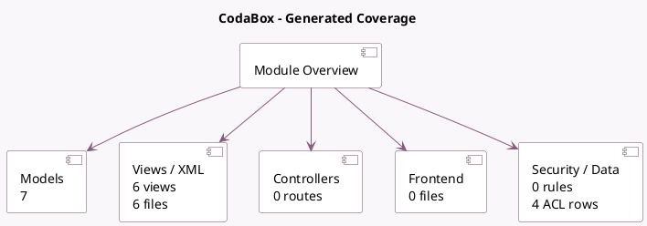

<!-- GENERATED:MODULE -->
---
tags: [odoo, enterprise, module]
---

# CodaBox

- Scope: Enterprise Addons
- Source: enterprise/l10n_be_codabox
- Dependencies: [[docs/Enterprise Addons/l10n_be_coda/l10n_be_coda|l10n_be_coda]], [[docs/Enterprise Addons/l10n_be_soda/l10n_be_soda|l10n_be_soda]], [[docs/Enterprise Addons/l10n_be_reports/l10n_be_reports|l10n_be_reports]]

## Generated coverage

- Models: 7
- XML files with UI/data artifacts: 6
- Views: 6
- Actions: 1
- Menus: 0
- Rules (ir.rule): 0
- Access CSV entries: 4
- Controller units: 0
- Frontend asset files: 0

## Module map

## Detail notes

- Models: [[docs/Enterprise Addons/l10n_be_codabox/Models|Models]] (7)
- Views and XML: [[docs/Enterprise Addons/l10n_be_codabox/Views|Views]] (6 files)

## Key models

- `account.journal`
- `l10n_be_codabox.change.password.wizard`
- `l10n_be_codabox.connection.wizard`
- `l10n_be_codabox.revoke.wizard`
- `l10n_be_codabox.validation.wizard`
- `res.company`
- `res.config.settings`

## Navigation

- [[../Enterprise Addons/Enterprise Addons|Back to scope]]
- [[../../docs/docs|Back to docs]]

<!-- GENERATED:MODULE -->

