<!-- GENERATED:MODEL -->
---
tags: [odoo, enterprise, generated, model]
---

# l10n_be_codaclean.connection.wizard

- Module: [[docs/Enterprise Addons/l10n_be_codaclean/l10n_be_codaclean|l10n_be_codaclean]]
- Scope: Enterprise Addons
- Defined in module: yes
- Source files: `wizard/connection_wizard.py`
- Python classes: `L10nBeCodacleanConnectionWizard`
- Description: Codaclean Connection Wizard

## Field footprint

- Detected fields: 7
- Field types: `Boolean` x 2, `Char` x 4, `Many2one` x 1
- Relation fields: 1

## Sample fields

- `codaclean_is_connected`: `Boolean` (related `company_id.l10n_be_codaclean_is_connected`)
- `company_id`: `Many2one` (comodel `res.company`)
- `iap_connection_exists`: `Boolean` (compute `_compute_iap_connection_exists`)
- `iap_token`: `Char` (related `company_id.l10n_be_codaclean_iap_token`)
- `password`: `Char`
- `username`: `Char`
- `warning`: `Char`

## Method hints

- Detected methods: 6
- Action methods: none
- Compute methods: `_compute_iap_connection_exists`
- Onchange methods: none

## Direct relation diagram

```plantuml
@startuml
!define ODOO_COLOR_PRIMARY #714B67
!define ODOO_COLOR_ACCENT #875A7B
!define ODOO_COLOR_BG #FAF7FA

skinparam backgroundColor ODOO_COLOR_BG
skinparam defaultTextAlignment left
skinparam ArrowColor ODOO_COLOR_ACCENT
skinparam ClassBackgroundColor white
skinparam ClassBorderColor ODOO_COLOR_PRIMARY
skinparam ComponentBackgroundColor white
skinparam ComponentBorderColor ODOO_COLOR_PRIMARY
skinparam NoteBackgroundColor #FFF8FF
skinparam NoteBorderColor ODOO_COLOR_ACCENT
skinparam SequenceLifeLineBorderColor ODOO_COLOR_ACCENT
skinparam SequenceLifeLineBackgroundColor #FFFFFF
skinparam SequenceParticipantBorderColor ODOO_COLOR_PRIMARY
skinparam SequenceParticipantBackgroundColor #FFFFFF
skinparam sequence {
  ArrowColor ODOO_COLOR_ACCENT
  ActorBorderColor ODOO_COLOR_PRIMARY
}
title l10n_be_codaclean.connection.wizard - Direct Relations
class "l10n_be_codaclean.connection.wizard" as l10n_be_codaclean_connection_wizard
class "res.company" as res_company
l10n_be_codaclean_connection_wizard --> res_company : company_id
@enduml
```

## Navigation

- **Parent:** [[docs/Enterprise Addons/l10n_be_codaclean/Models]]

<!-- GENERATED:MODEL -->
