<!-- GENERATED:MODEL -->
---
tags: [odoo, enterprise, generated, model]
---

# hr.contract.salary.offer

- Module: [[docs/Enterprise Addons/l10n_be_hr_contract_salary/l10n_be_hr_contract_salary|l10n_be_hr_contract_salary]]
- Scope: Enterprise Addons
- Defined in module: extension only
- Source files: `models/hr_contract_salary_offer.py`
- Python classes: `HrContractSalaryOffer`
- Description: Salary Package Offer

## Field footprint

- Detected fields: 8
- Field types: `Boolean` x 1, `Char` x 3, `Float` x 1, `Many2many` x 1, `Many2one` x 2
- Relation fields: 3

## Sample fields

- `additional_car_ids`: `Many2many` (comodel `fleet.vehicle`)
- `assigned_car_warning`: `Char` (compute `_compute_assigned_car_warning`)
- `car_id`: `Many2one` (comodel `fleet.vehicle`, compute `_compute_car_id`, store `True`)
- `contract_type_id`: `Many2one` (comodel `hr.contract.type`, compute `_compute_contract_type_id`, store `True`)
- `country_code`: `Char` (related `contract_template_id.country_code`)
- `l10n_be_canteen_cost`: `Float` (compute `_compute_l10n_be_canteen_cost`, store `True`)
- `new_car`: `Boolean` (compute `_compute_new_car`, store `True`)
- `wishlist_car_warning`: `Char` (compute `_compute_wishlist_car_warning`)

## Method hints

- Detected methods: 6
- Action methods: none
- Compute methods: `_compute_assigned_car_warning`, `_compute_car_id`, `_compute_contract_type_id`, `_compute_l10n_be_canteen_cost`, `_compute_new_car`, `_compute_wishlist_car_warning`
- Onchange methods: none

## Direct relation diagram

```plantuml
@startuml
!define ODOO_COLOR_PRIMARY #714B67
!define ODOO_COLOR_ACCENT #875A7B
!define ODOO_COLOR_BG #FAF7FA

skinparam backgroundColor ODOO_COLOR_BG
skinparam defaultTextAlignment left
skinparam ArrowColor ODOO_COLOR_ACCENT
skinparam ClassBackgroundColor white
skinparam ClassBorderColor ODOO_COLOR_PRIMARY
skinparam ComponentBackgroundColor white
skinparam ComponentBorderColor ODOO_COLOR_PRIMARY
skinparam NoteBackgroundColor #FFF8FF
skinparam NoteBorderColor ODOO_COLOR_ACCENT
skinparam SequenceLifeLineBorderColor ODOO_COLOR_ACCENT
skinparam SequenceLifeLineBackgroundColor #FFFFFF
skinparam SequenceParticipantBorderColor ODOO_COLOR_PRIMARY
skinparam SequenceParticipantBackgroundColor #FFFFFF
skinparam sequence {
  ArrowColor ODOO_COLOR_ACCENT
  ActorBorderColor ODOO_COLOR_PRIMARY
}
title hr.contract.salary.offer - Direct Relations
class "hr.contract.salary.offer" as hr_contract_salary_offer
class "fleet.vehicle" as fleet_vehicle
class "hr.contract.type" as hr_contract_type
hr_contract_salary_offer --> hr_contract_type : contract_type_id
hr_contract_salary_offer --> fleet_vehicle : car_id
hr_contract_salary_offer .. fleet_vehicle : additional_car_ids
@enduml
```

## Navigation

- **Parent:** [[docs/Enterprise Addons/l10n_be_hr_contract_salary/Models]]

<!-- GENERATED:MODEL -->
