<!-- GENERATED:MODEL -->
---
tags: [odoo, enterprise, generated, model]
---

# hr.version

- Module: [[docs/Enterprise Addons/l10n_be_hr_contract_salary/l10n_be_hr_contract_salary|l10n_be_hr_contract_salary]]
- Scope: Enterprise Addons
- Defined in module: extension only
- Source files: `models/hr_version.py`
- Python classes: `HrVersion`

## Field footprint

- Detected fields: 16
- Field types: `Binary` x 5, `Char` x 6, `Float` x 1, `Many2one` x 1, `Monetary` x 3
- Relation fields: 1

## Sample fields

- `contract_type_id`: `Many2one` (comodel `hr.contract.type`)
- `double_holiday_wage`: `Monetary` (compute `_compute_double_holiday_wage`)
- `driving_license`: `Binary` (related `employee_id.driving_license`)
- `driving_license_filename`: `Char`
- `id_card`: `Binary` (related `employee_id.id_card`)
- `id_card_filename`: `Char`
- `image_1920_filename`: `Char`
- `internet_invoice`: `Binary` (related `employee_id.internet_invoice`)
- `internet_invoice_filename`: `Char`
- `l10n_be_bicyle_cost`: `Float` (compute `_compute_l10n_be_bicyle_cost`)
- `l10n_be_mobility_budget_amount`: `Monetary` (compute `_compute_l10n_be_mobility_budget_amount`, store `True`)
- `l10n_be_wage_with_mobility_budget`: `Monetary` (compute `_compute_l10n_be_wage_with_mobility_budget`, store `True`)
- `mobile_invoice`: `Binary` (related `employee_id.mobile_invoice`)
- `mobile_invoice_filename`: `Char`
- `sim_card`: `Binary` (related `employee_id.sim_card`)
- `sim_card_filename`: `Char`

## Method hints

- Detected methods: 20
- Action methods: none
- Compute methods: `_compute_double_holiday_wage`, `_compute_l10n_be_bicyle_cost`, `_compute_l10n_be_is_below_scale`, `_compute_l10n_be_mobility_budget_amount`, `_compute_l10n_be_wage_with_mobility_budget`
- Onchange methods: none

## Direct relation diagram

```plantuml
@startuml
!define ODOO_COLOR_PRIMARY #714B67
!define ODOO_COLOR_ACCENT #875A7B
!define ODOO_COLOR_BG #FAF7FA

skinparam backgroundColor ODOO_COLOR_BG
skinparam defaultTextAlignment left
skinparam ArrowColor ODOO_COLOR_ACCENT
skinparam ClassBackgroundColor white
skinparam ClassBorderColor ODOO_COLOR_PRIMARY
skinparam ComponentBackgroundColor white
skinparam ComponentBorderColor ODOO_COLOR_PRIMARY
skinparam NoteBackgroundColor #FFF8FF
skinparam NoteBorderColor ODOO_COLOR_ACCENT
skinparam SequenceLifeLineBorderColor ODOO_COLOR_ACCENT
skinparam SequenceLifeLineBackgroundColor #FFFFFF
skinparam SequenceParticipantBorderColor ODOO_COLOR_PRIMARY
skinparam SequenceParticipantBackgroundColor #FFFFFF
skinparam sequence {
  ArrowColor ODOO_COLOR_ACCENT
  ActorBorderColor ODOO_COLOR_PRIMARY
}
title hr.version - Direct Relations
class "hr.version" as hr_version
class "hr.contract.type" as hr_contract_type
hr_version --> hr_contract_type : contract_type_id
@enduml
```

## Navigation

- **Parent:** [[docs/Enterprise Addons/l10n_be_hr_contract_salary/Models]]

<!-- GENERATED:MODEL -->
