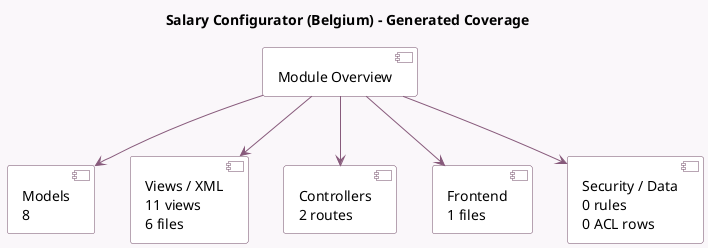

<!-- GENERATED:MODULE -->
---
tags: [odoo, enterprise, module]
---

# Salary Configurator (Belgium)

- Scope: Enterprise Addons
- Source: enterprise/l10n_be_hr_contract_salary
- Dependencies: [[docs/Enterprise Addons/hr_contract_salary_payroll/hr_contract_salary_payroll|hr_contract_salary_payroll]], [[docs/Enterprise Addons/l10n_be_hr_payroll_fleet/l10n_be_hr_payroll_fleet|l10n_be_hr_payroll_fleet]]

## Summary

Salary Package Configurator

## Generated coverage

- Models: 8
- XML files with UI/data artifacts: 6
- Views: 11
- Actions: 1
- Menus: 2
- Rules (ir.rule): 0
- Access CSV entries: 0
- Controller units: 1
- Frontend asset files: 1

## Module map

## Detail notes

- Models: [[docs/Enterprise Addons/l10n_be_hr_contract_salary/Models|Models]] (8)
- Views and XML: [[docs/Enterprise Addons/l10n_be_hr_contract_salary/Views|Views]] (6 files)
- Controllers: [[docs/Enterprise Addons/l10n_be_hr_contract_salary/Controllers|Controllers]] (1)
- Frontend: [[docs/Enterprise Addons/l10n_be_hr_contract_salary/Frontend|Frontend]] (1 files)

## Key models

- `fleet.vehicle.state`
- `hr.contract.salary.offer`
- `hr.contract.salary.resume`
- `hr.employee`
- `hr.job`
- `hr.payslip`
- `hr.version`
- `res.config.settings`

## Navigation

- [[../Enterprise Addons/Enterprise Addons|Back to scope]]
- [[../../docs/docs|Back to docs]]

<!-- GENERATED:MODULE -->

