<!-- GENERATED:MODEL -->
---
tags: [odoo, enterprise, generated, model]
---

# hr.employee

- Module: [[docs/Enterprise Addons/l10n_be_hr_payroll/l10n_be_hr_payroll|l10n_be_hr_payroll]]
- Scope: Enterprise Addons
- Defined in module: extension only
- Source files: `models/hr_employee.py`
- Python classes: `HrEmployee`

## Field footprint

- Detected fields: 82
- Field types: `Boolean` x 14, `Char` x 6, `Date` x 3, `Float` x 15, `Integer` x 9, `Many2many` x 2, `Monetary` x 29, `One2many` x 1, `Selection` x 1, `Text` x 2
- Relation fields: 3

## Sample fields

- `car_atn`: `Monetary` (related `version_id.car_atn`)
- `commission_on_target`: `Monetary` (related `version_id.commission_on_target`)
- `company_car_total_depreciated_cost`: `Monetary` (related `version_id.company_car_total_depreciated_cost`)
- `double_pay_line_ids`: `One2many` (comodel `l10n.be.double.pay.recovery.line`)
- `double_pay_line_n1_ids`: `Many2many` (comodel `l10n.be.double.pay.recovery.line`, compute `_compute_from_double_pay_line_ids`)
- `double_pay_line_n_ids`: `Many2many` (comodel `l10n.be.double.pay.recovery.line`, compute `_compute_from_double_pay_line_ids`)
- `eco_checks`: `Monetary` (related `version_id.eco_checks`)
- `end_notice_period`: `Date` (comodel `End notice period`)
- `first_contract_in_company`: `Date` (comodel `First contract in company`)
- `first_contract_year`: `Integer` (compute `_compute_first_contract_year`)
- `first_contract_year_n`: `Char` (compute `_compute_first_contract_year`)
- `first_contract_year_n1`: `Char` (compute `_compute_first_contract_year`)
- `first_contract_year_n_plus_1`: `Char` (compute `_compute_first_contract_year`)
- `fiscal_voluntarism`: `Monetary` (related `version_id.fiscal_voluntarism`)
- `fuel_card`: `Monetary` (related `version_id.fuel_card`)
- `has_hospital_insurance`: `Boolean` (related `version_id.has_hospital_insurance`)
- `has_laptop`: `Boolean` (related `version_id.has_laptop`)
- `hospital_insurance_amount_per_adult`: `Float` (related `version_id.hospital_insurance_amount_per_adult`)
- `hospital_insurance_amount_per_child`: `Float` (related `version_id.hospital_insurance_amount_per_child`)
- `insurance_amount`: `Float` (related `version_id.insurance_amount`)

## Method hints

- Detected methods: 26
- Action methods: `action_employee_work_schedule_change_wizard`, `action_open_attest_wizard`
- Compute methods: `_compute_first_contract_year`, `_compute_from_double_pay_line_ids`, `_compute_l10n_be_holiday_pay_recovered`, `_compute_niss`, `_compute_spouse_fiscal_status_explanation`
- Onchange methods: `_onchange_disabled_children_bool`, `_onchange_has_hospital_insurance`, `_onchange_l10n_be_has_ambulatory_insurance`, `_onchange_other_dependent_people`, `_onchange_transport_mode`, `_onchange_transport_mode_private_car`

## Direct relation diagram

```plantuml
@startuml
!define ODOO_COLOR_PRIMARY #714B67
!define ODOO_COLOR_ACCENT #875A7B
!define ODOO_COLOR_BG #FAF7FA

skinparam backgroundColor ODOO_COLOR_BG
skinparam defaultTextAlignment left
skinparam ArrowColor ODOO_COLOR_ACCENT
skinparam ClassBackgroundColor white
skinparam ClassBorderColor ODOO_COLOR_PRIMARY
skinparam ComponentBackgroundColor white
skinparam ComponentBorderColor ODOO_COLOR_PRIMARY
skinparam NoteBackgroundColor #FFF8FF
skinparam NoteBorderColor ODOO_COLOR_ACCENT
skinparam SequenceLifeLineBorderColor ODOO_COLOR_ACCENT
skinparam SequenceLifeLineBackgroundColor #FFFFFF
skinparam SequenceParticipantBorderColor ODOO_COLOR_PRIMARY
skinparam SequenceParticipantBackgroundColor #FFFFFF
skinparam sequence {
  ArrowColor ODOO_COLOR_ACCENT
  ActorBorderColor ODOO_COLOR_PRIMARY
}
title hr.employee - Direct Relations
class "hr.employee" as hr_employee
class "l10n.be.double.pay.recovery.line" as l10n_be_double_pay_recovery_line
hr_employee .. l10n_be_double_pay_recovery_line : double_pay_line_n_ids
hr_employee .. l10n_be_double_pay_recovery_line : double_pay_line_n1_ids
hr_employee --|> l10n_be_double_pay_recovery_line : double_pay_line_ids
@enduml
```

## Navigation

- **Parent:** [[docs/Enterprise Addons/l10n_be_hr_payroll/Models]]

<!-- GENERATED:MODEL -->
