<!-- GENERATED:MODEL -->
---
tags: [odoo, enterprise, generated, model]
---

# hr.payroll.alloc.employee

- Module: [[docs/Enterprise Addons/l10n_be_hr_payroll/l10n_be_hr_payroll|l10n_be_hr_payroll]]
- Scope: Enterprise Addons
- Defined in module: yes
- Source files: `wizard/hr_payroll_allocating_paid_time_off.py`
- Python classes: `HrPayrollAllocEmployee`
- Description: Manage the Allocation of Paid Time Off Employee

## Field footprint

- Detected fields: 6
- Field types: `Float` x 2, `Many2one` x 4
- Relation fields: 4

## Sample fields

- `alloc_paid_leave_id`: `Many2one` (comodel `hr.payroll.alloc.paid.leave`)
- `contract_next_year_id`: `Many2one` (comodel `hr.version`)
- `employee_id`: `Many2one` (comodel `hr.employee`)
- `paid_time_off`: `Float` (comodel `Paid Time Off For The Period`)
- `paid_time_off_to_allocate`: `Float` (comodel `Paid Time Off To Allocate`)
- `resource_calendar_id`: `Many2one` (related `contract_next_year_id.resource_calendar_id`)

## Method hints

- Detected methods: 0
- Action methods: none
- Compute methods: none
- Onchange methods: none

## Direct relation diagram

```plantuml
@startuml
!define ODOO_COLOR_PRIMARY #714B67
!define ODOO_COLOR_ACCENT #875A7B
!define ODOO_COLOR_BG #FAF7FA

skinparam backgroundColor ODOO_COLOR_BG
skinparam defaultTextAlignment left
skinparam ArrowColor ODOO_COLOR_ACCENT
skinparam ClassBackgroundColor white
skinparam ClassBorderColor ODOO_COLOR_PRIMARY
skinparam ComponentBackgroundColor white
skinparam ComponentBorderColor ODOO_COLOR_PRIMARY
skinparam NoteBackgroundColor #FFF8FF
skinparam NoteBorderColor ODOO_COLOR_ACCENT
skinparam SequenceLifeLineBorderColor ODOO_COLOR_ACCENT
skinparam SequenceLifeLineBackgroundColor #FFFFFF
skinparam SequenceParticipantBorderColor ODOO_COLOR_PRIMARY
skinparam SequenceParticipantBackgroundColor #FFFFFF
skinparam sequence {
  ArrowColor ODOO_COLOR_ACCENT
  ActorBorderColor ODOO_COLOR_PRIMARY
}
title hr.payroll.alloc.employee - Direct Relations
class "hr.payroll.alloc.employee" as hr_payroll_alloc_employee
class "hr.employee" as hr_employee
class "hr.payroll.alloc.paid.leave" as hr_payroll_alloc_paid_leave
class "hr.version" as hr_version
hr_payroll_alloc_employee --> hr_employee : employee_id
hr_payroll_alloc_employee --> hr_version : contract_next_year_id
hr_payroll_alloc_employee --> hr_payroll_alloc_paid_leave : alloc_paid_leave_id
@enduml
```

## Navigation

- **Parent:** [[docs/Enterprise Addons/l10n_be_hr_payroll/Models]]

<!-- GENERATED:MODEL -->
