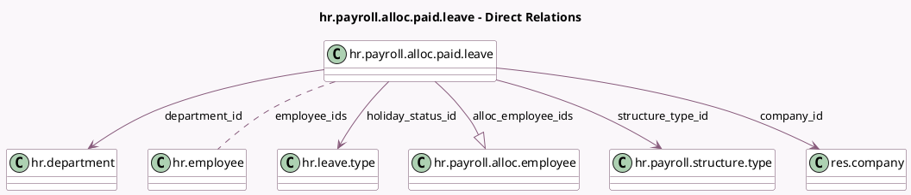

<!-- GENERATED:MODEL -->
---
tags: [odoo, enterprise, generated, model]
---

# hr.payroll.alloc.paid.leave

- Module: [[docs/Enterprise Addons/l10n_be_hr_payroll/l10n_be_hr_payroll|l10n_be_hr_payroll]]
- Scope: Enterprise Addons
- Defined in module: yes
- Source files: `wizard/hr_payroll_allocating_paid_time_off.py`
- Python classes: `HrPayrollAllocPaidLeave`
- Description: Manage the Allocation of Paid Time Off

## Field footprint

- Detected fields: 7
- Field types: `Many2many` x 1, `Many2one` x 4, `One2many` x 1, `Selection` x 1
- Relation fields: 6

## Sample fields

- `alloc_employee_ids`: `One2many` (comodel `hr.payroll.alloc.employee`, compute `_compute_alloc_employee_ids`)
- `company_id`: `Many2one` (comodel `res.company`)
- `department_id`: `Many2one` (comodel `hr.department`)
- `employee_ids`: `Many2many` (comodel `hr.employee`)
- `holiday_status_id`: `Many2one` (comodel `hr.leave.type`)
- `structure_type_id`: `Many2one` (comodel `hr.payroll.structure.type`)
- `year`: `Selection`

## Method hints

- Detected methods: 4
- Action methods: none
- Compute methods: `_compute_alloc_employee_ids`
- Onchange methods: none

## Direct relation diagram

## Navigation

- **Parent:** [[docs/Enterprise Addons/l10n_be_hr_payroll/Models]]

<!-- GENERATED:MODEL -->
