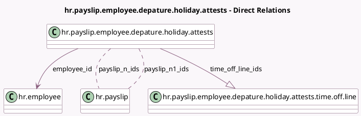

<!-- GENERATED:MODEL -->
---
tags: [odoo, enterprise, generated, model]
---

# hr.payslip.employee.depature.holiday.attests

- Module: [[docs/Enterprise Addons/l10n_be_hr_payroll/l10n_be_hr_payroll|l10n_be_hr_payroll]]
- Scope: Enterprise Addons
- Defined in module: yes
- Source files: `wizard/hr_payroll_employee_departure_holiday_attest.py`
- Python classes: `HrPayslipEmployeeDepatureHolidayAttests`
- Description: Manage the Employee Departure Holiday Attests

## Field footprint

- Detected fields: 13
- Field types: `Char` x 2, `Many2many` x 2, `Many2one` x 2, `Monetary` x 6, `One2many` x 1
- Relation fields: 5

## Sample fields

- `currency_id`: `Many2one` (related `employee_id.version_id.currency_id`)
- `employee_id`: `Many2one` (comodel `hr.employee`)
- `fictitious_remuneration_n`: `Monetary` (comodel `Remuneration fictitious current year`, compute `_compute_fictitious_remuneration_n`)
- `fictitious_remuneration_n1`: `Monetary` (comodel `Remuneration fictitious previous year`, compute `_compute_fictitious_remuneration_n1`)
- `gross_reference_remuneration_n`: `Monetary` (comodel `Gross reference remuneration current year`, compute `_compute_gross_reference_remuneration_n`)
- `gross_reference_remuneration_n1`: `Monetary` (comodel `Gross reference remuneration previous year`, compute `_compute_gross_reference_remuneration_n1`)
- `net_n`: `Monetary` (comodel `Gross Annual Remuneration Current Year`, compute `_compute_net_n`, store `True`)
- `net_n1`: `Monetary` (comodel `Gross Annual Remuneration Previous Year`, compute `_compute_net_n1`, store `True`)
- `number_n1_payslips_description`: `Char` (compute `_compute_number_n1_payslips_description`)
- `number_n_payslips_description`: `Char` (compute `_compute_number_n_payslips_description`)
- `payslip_n1_ids`: `Many2many` (comodel `hr.payslip`, compute `_compute_payslip_history`, store `True`)
- `payslip_n_ids`: `Many2many` (comodel `hr.payslip`, compute `_compute_payslip_history`, store `True`)
- `time_off_line_ids`: `One2many` (comodel `hr.payslip.employee.depature.holiday.attests.time.off.line`, compute `_compute_time_off_line_ids`, store `True`)

## Method hints

- Detected methods: 13
- Action methods: none
- Compute methods: `_compute_fictitious_remuneration_n`, `_compute_fictitious_remuneration_n1`, `_compute_gross_reference_remuneration_n`, `_compute_gross_reference_remuneration_n1`, `_compute_net_n`, `_compute_net_n1`, `_compute_number_n1_payslips_description`, `_compute_number_n_payslips_description`, and 2 more
- Onchange methods: none

## Direct relation diagram

## Navigation

- **Parent:** [[docs/Enterprise Addons/l10n_be_hr_payroll/Models]]

<!-- GENERATED:MODEL -->
