<!-- GENERATED:MODEL -->
---
tags: [odoo, enterprise, generated, model]
---

# hr.payslip.employee.depature.holiday.attests.time.off.line

- Module: [[docs/Enterprise Addons/l10n_be_hr_payroll/l10n_be_hr_payroll|l10n_be_hr_payroll]]
- Scope: Enterprise Addons
- Defined in module: yes
- Source files: `wizard/hr_payroll_employee_departure_holiday_attest.py`
- Python classes: `HrPayslipEmployeeDepatureHolidayAttestsTimeOffLine`
- Description: Holiday Attest Time Off Line

## Field footprint

- Detected fields: 5
- Field types: `Integer` x 3, `Many2one` x 2
- Relation fields: 2

## Sample fields

- `leave_allocation_count`: `Integer`
- `leave_count`: `Integer`
- `leave_type_id`: `Many2one` (comodel `hr.leave.type`)
- `wizard_id`: `Many2one` (comodel `hr.payslip.employee.depature.holiday.attests`)
- `year`: `Integer`

## Method hints

- Detected methods: 0
- Action methods: none
- Compute methods: none
- Onchange methods: none

## Direct relation diagram

```plantuml
@startuml
!define ODOO_COLOR_PRIMARY #714B67
!define ODOO_COLOR_ACCENT #875A7B
!define ODOO_COLOR_BG #FAF7FA

skinparam backgroundColor ODOO_COLOR_BG
skinparam defaultTextAlignment left
skinparam ArrowColor ODOO_COLOR_ACCENT
skinparam ClassBackgroundColor white
skinparam ClassBorderColor ODOO_COLOR_PRIMARY
skinparam ComponentBackgroundColor white
skinparam ComponentBorderColor ODOO_COLOR_PRIMARY
skinparam NoteBackgroundColor #FFF8FF
skinparam NoteBorderColor ODOO_COLOR_ACCENT
skinparam SequenceLifeLineBorderColor ODOO_COLOR_ACCENT
skinparam SequenceLifeLineBackgroundColor #FFFFFF
skinparam SequenceParticipantBorderColor ODOO_COLOR_PRIMARY
skinparam SequenceParticipantBackgroundColor #FFFFFF
skinparam sequence {
  ArrowColor ODOO_COLOR_ACCENT
  ActorBorderColor ODOO_COLOR_PRIMARY
}
title hr.payslip.employee.depature.holiday.attests.time.off.line - Direct Relations
class "hr.payslip.employee.depature.holiday.attests.time.off.line" as hr_payslip_employee_depature_holiday_attests_time_off_line
class "hr.leave.type" as hr_leave_type
class "hr.payslip.employee.depature.holiday.attests" as hr_payslip_employee_depature_holiday_attests
hr_payslip_employee_depature_holiday_attests_time_off_line --> hr_payslip_employee_depature_holiday_attests : wizard_id
hr_payslip_employee_depature_holiday_attests_time_off_line --> hr_leave_type : leave_type_id
@enduml
```

## Navigation

- **Parent:** [[docs/Enterprise Addons/l10n_be_hr_payroll/Models]]

<!-- GENERATED:MODEL -->
