<!-- GENERATED:MODEL -->
---
tags: [odoo, enterprise, generated, model]
---

# hr.payslip.employee.depature.notice

- Module: [[docs/Enterprise Addons/l10n_be_hr_payroll/l10n_be_hr_payroll|l10n_be_hr_payroll]]
- Scope: Enterprise Addons
- Defined in module: yes
- Source files: `wizard/hr_payroll_employee_departure_notice.py`
- Python classes: `HrPayslipEmployeeDepatureNotice`
- Description: Manage the Employee Departure - Notice Duration

## Field footprint

- Detected fields: 18
- Field types: `Boolean` x 2, `Char` x 2, `Date` x 4, `Integer` x 5, `Many2one` x 3, `Selection` x 2
- Relation fields: 3

## Sample fields

- `actual_notice_duration`: `Integer` (comodel `Actual Notice Duration`, compute `_compute_actual_notice_duration`)
- `departure_date`: `Date`
- `departure_description`: `Char` (comodel `Departure Description`)
- `departure_reason_code`: `Integer` (related `leaving_type_id.l10n_be_reason_code`)
- `employee_id`: `Many2one` (comodel `hr.employee`)
- `end_notice_period`: `Date` (comodel `End Notice Period`, compute `_compute_end_notice_period`, store `True`)
- `first_contract`: `Date` (compute `_compute_oldest_contract_id`)
- `l10n_be_scale_seniority`: `Integer` (related `employee_id.l10n_be_scale_seniority`)
- `leaving_type_id`: `Many2one` (comodel `hr.departure.reason`)
- `notice_duration_month_before_2014`: `Integer` (comodel `Notice Duration in month`, compute `_notice_duration`)
- `notice_duration_week_after_2014`: `Integer` (comodel `Notice Duration in weeks`, compute `_notice_duration`)
- `notice_respect`: `Selection`
- `oldest_contract_id`: `Many2one` (comodel `hr.version`, compute `_compute_oldest_contract_id`)
- `salary_december_2013`: `Selection`
- `salary_visibility`: `Boolean` (comodel `Salary as of December 2013`)
- `seniority_description`: `Char` (compute `_compute_seniority_description`)
- `start_notice_period`: `Date` (compute `_compute_start_notice_period`)
- `use_seniority_at_hiring`: `Boolean`

## Method hints

- Detected methods: 14
- Action methods: none
- Compute methods: `_compute_actual_notice_duration`, `_compute_end_notice_period`, `_compute_oldest_contract_id`, `_compute_seniority_description`, `_compute_start_notice_period`
- Onchange methods: `_onchange_leaving_type_id`

## Direct relation diagram

```plantuml
@startuml
!define ODOO_COLOR_PRIMARY #714B67
!define ODOO_COLOR_ACCENT #875A7B
!define ODOO_COLOR_BG #FAF7FA

skinparam backgroundColor ODOO_COLOR_BG
skinparam defaultTextAlignment left
skinparam ArrowColor ODOO_COLOR_ACCENT
skinparam ClassBackgroundColor white
skinparam ClassBorderColor ODOO_COLOR_PRIMARY
skinparam ComponentBackgroundColor white
skinparam ComponentBorderColor ODOO_COLOR_PRIMARY
skinparam NoteBackgroundColor #FFF8FF
skinparam NoteBorderColor ODOO_COLOR_ACCENT
skinparam SequenceLifeLineBorderColor ODOO_COLOR_ACCENT
skinparam SequenceLifeLineBackgroundColor #FFFFFF
skinparam SequenceParticipantBorderColor ODOO_COLOR_PRIMARY
skinparam SequenceParticipantBackgroundColor #FFFFFF
skinparam sequence {
  ArrowColor ODOO_COLOR_ACCENT
  ActorBorderColor ODOO_COLOR_PRIMARY
}
title hr.payslip.employee.depature.notice - Direct Relations
class "hr.payslip.employee.depature.notice" as hr_payslip_employee_depature_notice
class "hr.departure.reason" as hr_departure_reason
class "hr.employee" as hr_employee
class "hr.version" as hr_version
hr_payslip_employee_depature_notice --> hr_employee : employee_id
hr_payslip_employee_depature_notice --> hr_departure_reason : leaving_type_id
hr_payslip_employee_depature_notice --> hr_version : oldest_contract_id
@enduml
```

## Navigation

- **Parent:** [[docs/Enterprise Addons/l10n_be_hr_payroll/Models]]

<!-- GENERATED:MODEL -->
