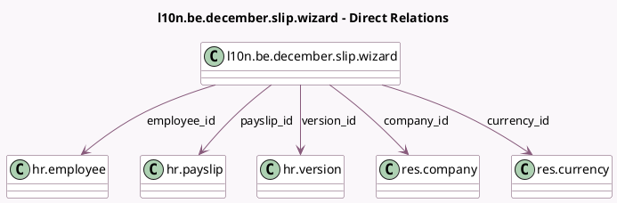

<!-- GENERATED:MODEL -->
---
tags: [odoo, enterprise, generated, model]
---

# l10n.be.december.slip.wizard

- Module: [[docs/Enterprise Addons/l10n_be_hr_payroll/l10n_be_hr_payroll|l10n_be_hr_payroll]]
- Scope: Enterprise Addons
- Defined in module: yes
- Source files: `wizard/l10n_be_december_slip_wizard.py`
- Python classes: `L10nBeDecemberSlipWizard`
- Description: CP200: December Slip Computation

## Field footprint

- Detected fields: 12
- Field types: `Many2one` x 5, `Monetary` x 7
- Relation fields: 5

## Sample fields

- `company_id`: `Many2one` (comodel `res.company`)
- `currency_id`: `Many2one` (comodel `res.currency`, related `company_id.currency_id`)
- `double_december_pay`: `Monetary` (compute `_compute_double_december_pay`, store `True`)
- `double_holiday_n`: `Monetary` (compute `_compute_holiday_pay_n`, store `True`)
- `double_holiday_n1`: `Monetary` (compute `_compute_holiday_pay_n1`, store `True`)
- `employee_id`: `Many2one` (comodel `hr.employee`, related `payslip_id.employee_id`)
- `payslip_id`: `Many2one` (comodel `hr.payslip`)
- `remuneration_n1`: `Monetary` (compute `_compute_remuneration_n1`, store `True`)
- `simple_december_pay`: `Monetary` (compute `_compute_simple_december_pay`, store `True`)
- `simple_holiday_n`: `Monetary` (compute `_compute_holiday_pay_n`, store `True`)
- `simple_holiday_n1`: `Monetary` (compute `_compute_holiday_pay_n1`, store `True`)
- `version_id`: `Many2one` (comodel `hr.version`, related `payslip_id.version_id`)

## Method hints

- Detected methods: 7
- Action methods: `action_validate`
- Compute methods: `_compute_double_december_pay`, `_compute_holiday_pay_n`, `_compute_holiday_pay_n1`, `_compute_remuneration_n1`, `_compute_simple_december_pay`
- Onchange methods: none

## Direct relation diagram

## Navigation

- **Parent:** [[docs/Enterprise Addons/l10n_be_hr_payroll/Models]]

<!-- GENERATED:MODEL -->
