<!-- GENERATED:MODEL -->
---
tags: [odoo, enterprise, generated, model]
---

# l10n.be.double.pay.recovery.line.wizard

- Module: [[docs/Enterprise Addons/l10n_be_hr_payroll/l10n_be_hr_payroll|l10n_be_hr_payroll]]
- Scope: Enterprise Addons
- Defined in module: yes
- Source files: `wizard/l10n_be_double_pay_recovery_wizard.py`
- Python classes: `L10nBeDoublePayRecoveryLineWizard`
- Description: CP200: Double Pay Recovery Line Wizard

## Field footprint

- Detected fields: 7
- Field types: `Float` x 2, `Integer` x 1, `Many2one` x 3, `Monetary` x 1
- Relation fields: 3

## Sample fields

- `amount`: `Monetary`
- `company_calendar`: `Many2one` (related `wizard_id.company_calendar`)
- `currency_id`: `Many2one` (related `wizard_id.currency_id`)
- `months_count`: `Float`
- `occupation_rate`: `Float`
- `wizard_id`: `Many2one` (comodel `l10n.be.double.pay.recovery.wizard`)
- `year`: `Integer`

## Method hints

- Detected methods: 0
- Action methods: none
- Compute methods: none
- Onchange methods: none

## Direct relation diagram

```plantuml
@startuml
!define ODOO_COLOR_PRIMARY #714B67
!define ODOO_COLOR_ACCENT #875A7B
!define ODOO_COLOR_BG #FAF7FA

skinparam backgroundColor ODOO_COLOR_BG
skinparam defaultTextAlignment left
skinparam ArrowColor ODOO_COLOR_ACCENT
skinparam ClassBackgroundColor white
skinparam ClassBorderColor ODOO_COLOR_PRIMARY
skinparam ComponentBackgroundColor white
skinparam ComponentBorderColor ODOO_COLOR_PRIMARY
skinparam NoteBackgroundColor #FFF8FF
skinparam NoteBorderColor ODOO_COLOR_ACCENT
skinparam SequenceLifeLineBorderColor ODOO_COLOR_ACCENT
skinparam SequenceLifeLineBackgroundColor #FFFFFF
skinparam SequenceParticipantBorderColor ODOO_COLOR_PRIMARY
skinparam SequenceParticipantBackgroundColor #FFFFFF
skinparam sequence {
  ArrowColor ODOO_COLOR_ACCENT
  ActorBorderColor ODOO_COLOR_PRIMARY
}
title l10n.be.double.pay.recovery.line.wizard - Direct Relations
class "l10n.be.double.pay.recovery.line.wizard" as l10n_be_double_pay_recovery_line_wizard
class "l10n.be.double.pay.recovery.wizard" as l10n_be_double_pay_recovery_wizard
l10n_be_double_pay_recovery_line_wizard --> l10n_be_double_pay_recovery_wizard : wizard_id
@enduml
```

## Navigation

- **Parent:** [[docs/Enterprise Addons/l10n_be_hr_payroll/Models]]

<!-- GENERATED:MODEL -->
