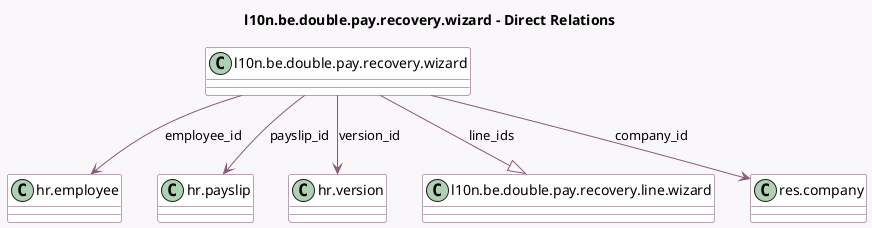

<!-- GENERATED:MODEL -->
---
tags: [odoo, enterprise, generated, model]
---

# l10n.be.double.pay.recovery.wizard

- Module: [[docs/Enterprise Addons/l10n_be_hr_payroll/l10n_be_hr_payroll|l10n_be_hr_payroll]]
- Scope: Enterprise Addons
- Defined in module: yes
- Source files: `wizard/l10n_be_double_pay_recovery_wizard.py`
- Python classes: `L10nBeDoublePayRecoveryWizard`
- Description: CP200: Double Pay Recovery Wizard

## Field footprint

- Detected fields: 12
- Field types: `Char` x 1, `Float` x 1, `Many2one` x 6, `Monetary` x 3, `One2many` x 1
- Relation fields: 7

## Sample fields

- `company_calendar`: `Many2one` (related `company_id.resource_calendar_id`)
- `company_id`: `Many2one` (comodel `res.company`)
- `currency_id`: `Many2one` (related `company_id.currency_id`)
- `double_pay_to_recover`: `Monetary` (compute `_compute_amounts_to_recover`, store `True`)
- `employee_id`: `Many2one` (comodel `hr.employee`)
- `gross_salary`: `Monetary` (compute `_compute_gross_salary`, store `True`)
- `line_ids`: `One2many` (comodel `l10n.be.double.pay.recovery.line.wizard`, compute `_compute_line_ids`, store `True`)
- `months_count`: `Float` (compute `_compute_months_count`)
- `months_count_description`: `Char` (compute `_compute_months_count`)
- `payslip_id`: `Many2one` (comodel `hr.payslip`)
- `threshold`: `Monetary` (compute `_compute_amounts_to_recover`, store `True`)
- `version_id`: `Many2one` (comodel `hr.version`)

## Method hints

- Detected methods: 6
- Action methods: `action_validate`
- Compute methods: `_compute_amounts_to_recover`, `_compute_gross_salary`, `_compute_line_ids`, `_compute_months_count`
- Onchange methods: none

## Direct relation diagram

## Navigation

- **Parent:** [[docs/Enterprise Addons/l10n_be_hr_payroll/Models]]

<!-- GENERATED:MODEL -->
