<!-- GENERATED:MODEL -->
---
tags: [odoo, enterprise, generated, model]
---

# l10n.be.eco.vouchers.wizard

- Module: [[docs/Enterprise Addons/l10n_be_hr_payroll/l10n_be_hr_payroll|l10n_be_hr_payroll]]
- Scope: Enterprise Addons
- Defined in module: yes
- Source files: `wizard/l10n_be_eco_vouchers_wizard.py`
- Python classes: `L10nBeEcoVouchersWizard`
- Description: Eco-Vouchers Wizard

## Field footprint

- Detected fields: 7
- Field types: `Date` x 2, `Html` x 1, `Many2one` x 2, `One2many` x 1, `Selection` x 1
- Relation fields: 3

## Sample fields

- `company_id`: `Many2one` (comodel `res.company`)
- `currency_id`: `Many2one` (related `company_id.currency_id`)
- `date_end`: `Date` (compute `_compute_reference_period`)
- `date_start`: `Date` (compute `_compute_reference_period`)
- `line_ids`: `One2many` (comodel `l10n.be.eco.vouchers.line.wizard`, compute `_compute_line_ids`, store `True`)
- `reference_period`: `Html` (compute `_compute_reference_period`)
- `reference_year`: `Selection`

## Method hints

- Detected methods: 6
- Action methods: `action_export_xls`
- Compute methods: `_compute_line_ids`, `_compute_reference_period`
- Onchange methods: none

## Direct relation diagram

```plantuml
@startuml
!define ODOO_COLOR_PRIMARY #714B67
!define ODOO_COLOR_ACCENT #875A7B
!define ODOO_COLOR_BG #FAF7FA

skinparam backgroundColor ODOO_COLOR_BG
skinparam defaultTextAlignment left
skinparam ArrowColor ODOO_COLOR_ACCENT
skinparam ClassBackgroundColor white
skinparam ClassBorderColor ODOO_COLOR_PRIMARY
skinparam ComponentBackgroundColor white
skinparam ComponentBorderColor ODOO_COLOR_PRIMARY
skinparam NoteBackgroundColor #FFF8FF
skinparam NoteBorderColor ODOO_COLOR_ACCENT
skinparam SequenceLifeLineBorderColor ODOO_COLOR_ACCENT
skinparam SequenceLifeLineBackgroundColor #FFFFFF
skinparam SequenceParticipantBorderColor ODOO_COLOR_PRIMARY
skinparam SequenceParticipantBackgroundColor #FFFFFF
skinparam sequence {
  ArrowColor ODOO_COLOR_ACCENT
  ActorBorderColor ODOO_COLOR_PRIMARY
}
title l10n.be.eco.vouchers.wizard - Direct Relations
class "l10n.be.eco.vouchers.wizard" as l10n_be_eco_vouchers_wizard
class "l10n.be.eco.vouchers.line.wizard" as l10n_be_eco_vouchers_line_wizard
class "res.company" as res_company
l10n_be_eco_vouchers_wizard --|> l10n_be_eco_vouchers_line_wizard : line_ids
l10n_be_eco_vouchers_wizard --> res_company : company_id
@enduml
```

## Navigation

- **Parent:** [[docs/Enterprise Addons/l10n_be_hr_payroll/Models]]

<!-- GENERATED:MODEL -->
