<!-- GENERATED:MODEL -->
---
tags: [odoo, enterprise, generated, model]
---

# l10n.be.onss.declaration

- Module: [[docs/Enterprise Addons/l10n_be_hr_payroll/l10n_be_hr_payroll|l10n_be_hr_payroll]]
- Scope: Enterprise Addons
- Defined in module: yes
- Source files: `models/l10n_be_onss_declaration.py`
- Python classes: `L10nBeOnssDeclaration`
- Description: ONSS Declaration

## Field footprint

- Detected fields: 8
- Field types: `Char` x 1, `Integer` x 1, `Many2one` x 2, `One2many` x 1, `Selection` x 2, `Text` x 1
- Relation fields: 3

## Sample fields

- `company_id`: `Many2one` (comodel `res.company`, related `dmfa_id.company_id`, store `True`)
- `dmfa_id`: `Many2one` (comodel `l10n_be.dmfa`)
- `environment`: `Selection`
- `error_message`: `Text`
- `name`: `Char` (compute `_compute_name`, store `True`)
- `onss_file_count`: `Integer` (compute `_compute_onss_file_count`)
- `onss_file_ids`: `One2many` (comodel `l10n.be.onss.file`)
- `state`: `Selection`

## Method hints

- Detected methods: 13
- Action methods: `action_open_onss_file`, `action_post`, `action_test_sftp_connection`
- Compute methods: `_compute_name`, `_compute_onss_file_count`
- Onchange methods: none

## Direct relation diagram

```plantuml
@startuml
!define ODOO_COLOR_PRIMARY #714B67
!define ODOO_COLOR_ACCENT #875A7B
!define ODOO_COLOR_BG #FAF7FA

skinparam backgroundColor ODOO_COLOR_BG
skinparam defaultTextAlignment left
skinparam ArrowColor ODOO_COLOR_ACCENT
skinparam ClassBackgroundColor white
skinparam ClassBorderColor ODOO_COLOR_PRIMARY
skinparam ComponentBackgroundColor white
skinparam ComponentBorderColor ODOO_COLOR_PRIMARY
skinparam NoteBackgroundColor #FFF8FF
skinparam NoteBorderColor ODOO_COLOR_ACCENT
skinparam SequenceLifeLineBorderColor ODOO_COLOR_ACCENT
skinparam SequenceLifeLineBackgroundColor #FFFFFF
skinparam SequenceParticipantBorderColor ODOO_COLOR_PRIMARY
skinparam SequenceParticipantBackgroundColor #FFFFFF
skinparam sequence {
  ArrowColor ODOO_COLOR_ACCENT
  ActorBorderColor ODOO_COLOR_PRIMARY
}
title l10n.be.onss.declaration - Direct Relations
class "l10n.be.onss.declaration" as l10n_be_onss_declaration
class "l10n.be.onss.file" as l10n_be_onss_file
class "l10n_be.dmfa" as l10n_be_dmfa
class "res.company" as res_company
l10n_be_onss_declaration --> l10n_be_dmfa : dmfa_id
l10n_be_onss_declaration --> res_company : company_id
l10n_be_onss_declaration --|> l10n_be_onss_file : onss_file_ids
@enduml
```

## Navigation

- **Parent:** [[docs/Enterprise Addons/l10n_be_hr_payroll/Models]]

<!-- GENERATED:MODEL -->
