<!-- GENERATED:MODEL -->
---
tags: [odoo, enterprise, generated, model]
---

# l10n.be.onss.file

- Module: [[docs/Enterprise Addons/l10n_be_hr_payroll/l10n_be_hr_payroll|l10n_be_hr_payroll]]
- Scope: Enterprise Addons
- Defined in module: yes
- Source files: `models/l10n_be_onss_file.py`
- Python classes: `L10nBeOnssFile`
- Description: ONSS File

## Field footprint

- Detected fields: 16
- Field types: `Binary` x 1, `Char` x 5, `Date` x 1, `Integer` x 2, `Many2one` x 3, `Selection` x 3, `Text` x 1
- Relation fields: 3

## Sample fields

- `company_id`: `Many2one` (comodel `res.company`, related `onss_declaration_id.company_id`, store `True`)
- `creation_date`: `Date` (compute `_compute_file_description`, store `True`)
- `declaration_type`: `Selection` (compute `_compute_file_description`, store `True`)
- `employee_id`: `Many2one` (comodel `hr.employee`)
- `environment`: `Selection` (compute `_compute_file_description`, store `True`)
- `expeditor_number`: `Char` (compute `_compute_file_description`, store `True`)
- `file`: `Binary` (comodel `File`)
- `file_content`: `Text` (compute `_compute_file_content`, store `True`)
- `file_count`: `Integer` (compute `_compute_file_description`, store `True`)
- `file_number`: `Integer` (compute `_compute_file_description`, store `True`)
- `file_sequence`: `Char` (compute `_compute_file_description`, store `True`)
- `file_type`: `Selection` (compute `_compute_file_description`, store `True`)
- `form_creation_date`: `Char` (compute `_compute_form_creation_date`, store `True`)
- `form_creation_hour`: `Char` (compute `_compute_form_creation_date`, store `True`)
- `name`: `Char` (comodel `File Name`)
- `onss_declaration_id`: `Many2one` (comodel `l10n.be.onss.declaration`)

## Method hints

- Detected methods: 3
- Action methods: none
- Compute methods: `_compute_file_content`, `_compute_file_description`, `_compute_form_creation_date`
- Onchange methods: none

## Direct relation diagram

```plantuml
@startuml
!define ODOO_COLOR_PRIMARY #714B67
!define ODOO_COLOR_ACCENT #875A7B
!define ODOO_COLOR_BG #FAF7FA

skinparam backgroundColor ODOO_COLOR_BG
skinparam defaultTextAlignment left
skinparam ArrowColor ODOO_COLOR_ACCENT
skinparam ClassBackgroundColor white
skinparam ClassBorderColor ODOO_COLOR_PRIMARY
skinparam ComponentBackgroundColor white
skinparam ComponentBorderColor ODOO_COLOR_PRIMARY
skinparam NoteBackgroundColor #FFF8FF
skinparam NoteBorderColor ODOO_COLOR_ACCENT
skinparam SequenceLifeLineBorderColor ODOO_COLOR_ACCENT
skinparam SequenceLifeLineBackgroundColor #FFFFFF
skinparam SequenceParticipantBorderColor ODOO_COLOR_PRIMARY
skinparam SequenceParticipantBackgroundColor #FFFFFF
skinparam sequence {
  ArrowColor ODOO_COLOR_ACCENT
  ActorBorderColor ODOO_COLOR_PRIMARY
}
title l10n.be.onss.file - Direct Relations
class "l10n.be.onss.file" as l10n_be_onss_file
class "hr.employee" as hr_employee
class "l10n.be.onss.declaration" as l10n_be_onss_declaration
class "res.company" as res_company
l10n_be_onss_file --> l10n_be_onss_declaration : onss_declaration_id
l10n_be_onss_file --> hr_employee : employee_id
l10n_be_onss_file --> res_company : company_id
@enduml
```

## Navigation

- **Parent:** [[docs/Enterprise Addons/l10n_be_hr_payroll/Models]]

<!-- GENERATED:MODEL -->
