<!-- GENERATED:MODEL -->
---
tags: [odoo, enterprise, generated, model]
---

# l10n.be.social.security.certificate

- Module: [[docs/Enterprise Addons/l10n_be_hr_payroll/l10n_be_hr_payroll|l10n_be_hr_payroll]]
- Scope: Enterprise Addons
- Defined in module: yes
- Source files: `wizard/l10n_be_social_security_certificate.py`
- Python classes: `L10nBeSocialSecurityCertificate`
- Description: Belgium: Social Security Certificate

## Field footprint

- Detected fields: 10
- Field types: `Binary` x 2, `Char` x 2, `Date` x 2, `Many2one` x 1, `Selection` x 3
- Relation fields: 1

## Sample fields

- `aggregation_level`: `Selection`
- `company_id`: `Many2one` (comodel `res.company`)
- `date_from`: `Date`
- `date_to`: `Date`
- `social_security_filename`: `Char`
- `social_security_filename_xlsx`: `Char`
- `social_security_sheet`: `Binary` (comodel `Social Security Certificate`)
- `social_security_xlsx`: `Binary` (comodel `Social Security Certificate Spreadsheet`)
- `state`: `Selection`
- `state_xlsx`: `Selection`

## Method hints

- Detected methods: 6
- Action methods: `action_validate`
- Compute methods: none
- Onchange methods: none

## Direct relation diagram

```plantuml
@startuml
!define ODOO_COLOR_PRIMARY #714B67
!define ODOO_COLOR_ACCENT #875A7B
!define ODOO_COLOR_BG #FAF7FA

skinparam backgroundColor ODOO_COLOR_BG
skinparam defaultTextAlignment left
skinparam ArrowColor ODOO_COLOR_ACCENT
skinparam ClassBackgroundColor white
skinparam ClassBorderColor ODOO_COLOR_PRIMARY
skinparam ComponentBackgroundColor white
skinparam ComponentBorderColor ODOO_COLOR_PRIMARY
skinparam NoteBackgroundColor #FFF8FF
skinparam NoteBorderColor ODOO_COLOR_ACCENT
skinparam SequenceLifeLineBorderColor ODOO_COLOR_ACCENT
skinparam SequenceLifeLineBackgroundColor #FFFFFF
skinparam SequenceParticipantBorderColor ODOO_COLOR_PRIMARY
skinparam SequenceParticipantBackgroundColor #FFFFFF
skinparam sequence {
  ArrowColor ODOO_COLOR_ACCENT
  ActorBorderColor ODOO_COLOR_PRIMARY
}
title l10n.be.social.security.certificate - Direct Relations
class "l10n.be.social.security.certificate" as l10n_be_social_security_certificate
class "res.company" as res_company
l10n_be_social_security_certificate --> res_company : company_id
@enduml
```

## Navigation

- **Parent:** [[docs/Enterprise Addons/l10n_be_hr_payroll/Models]]

<!-- GENERATED:MODEL -->
