<!-- GENERATED:MODEL -->
---
tags: [odoo, enterprise, generated, model]
---

# l10n_be.273s

- Module: [[docs/Enterprise Addons/l10n_be_hr_payroll/l10n_be_hr_payroll|l10n_be_hr_payroll]]
- Scope: Enterprise Addons
- Defined in module: yes
- Source files: `models/l10n_be_273S.py`
- Python classes: `L10n_Be273s`
- Description: 273S Sheet

## Field footprint

- Detected fields: 12
- Field types: `Binary` x 2, `Char` x 3, `Date` x 1, `Integer` x 1, `Many2one` x 2, `Selection` x 3
- Relation fields: 2

## Sample fields

- `company_id`: `Many2one` (comodel `res.company`)
- `currency_id`: `Many2one` (comodel `res.currency`, related `company_id.currency_id`)
- `error_message`: `Char` (comodel `Error Message`, compute `_compute_validation_state`, store `True`)
- `month`: `Selection`
- `pdf_file`: `Binary`
- `pdf_filename`: `Char` (comodel `PDF Filename`)
- `period`: `Date` (comodel `Period`, compute `_compute_period`, store `True`)
- `state`: `Selection` (compute `_compute_state`, store `True`)
- `xml_file`: `Binary`
- `xml_filename`: `Char` (comodel `XML Filename`)
- `xml_validation_state`: `Selection` (compute `_compute_validation_state`, store `True`)
- `year`: `Integer`

## Method hints

- Detected methods: 9
- Action methods: `action_generate_pdf`, `action_generate_xml`, `action_validate`
- Compute methods: `_compute_display_name`, `_compute_period`, `_compute_state`, `_compute_validation_state`
- Onchange methods: none

## Direct relation diagram

```plantuml
@startuml
!define ODOO_COLOR_PRIMARY #714B67
!define ODOO_COLOR_ACCENT #875A7B
!define ODOO_COLOR_BG #FAF7FA

skinparam backgroundColor ODOO_COLOR_BG
skinparam defaultTextAlignment left
skinparam ArrowColor ODOO_COLOR_ACCENT
skinparam ClassBackgroundColor white
skinparam ClassBorderColor ODOO_COLOR_PRIMARY
skinparam ComponentBackgroundColor white
skinparam ComponentBorderColor ODOO_COLOR_PRIMARY
skinparam NoteBackgroundColor #FFF8FF
skinparam NoteBorderColor ODOO_COLOR_ACCENT
skinparam SequenceLifeLineBorderColor ODOO_COLOR_ACCENT
skinparam SequenceLifeLineBackgroundColor #FFFFFF
skinparam SequenceParticipantBorderColor ODOO_COLOR_PRIMARY
skinparam SequenceParticipantBackgroundColor #FFFFFF
skinparam sequence {
  ArrowColor ODOO_COLOR_ACCENT
  ActorBorderColor ODOO_COLOR_PRIMARY
}
title l10n_be.273s - Direct Relations
class "l10n_be.273s" as l10n_be_273s
class "res.company" as res_company
class "res.currency" as res_currency
l10n_be_273s --> res_company : company_id
l10n_be_273s --> res_currency : currency_id
@enduml
```

## Navigation

- **Parent:** [[docs/Enterprise Addons/l10n_be_hr_payroll/Models]]

<!-- GENERATED:MODEL -->
