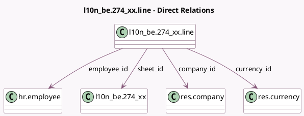

<!-- GENERATED:MODEL -->
---
tags: [odoo, enterprise, generated, model]
---

# l10n_be.274_xx.line

- Module: [[docs/Enterprise Addons/l10n_be_hr_payroll/l10n_be_hr_payroll|l10n_be_hr_payroll]]
- Scope: Enterprise Addons
- Defined in module: yes
- Source files: `models/l10n_be_274_XX.py`
- Python classes: `L10n_Be274_XxLine`
- Description: 274.XX Sheets Line

## Field footprint

- Detected fields: 7
- Field types: `Many2one` x 4, `Monetary` x 2, `Selection` x 1
- Relation fields: 4

## Sample fields

- `amount`: `Monetary`
- `certificate`: `Selection` (related `employee_id.certificate`)
- `company_id`: `Many2one` (comodel `res.company`, related `sheet_id.company_id`)
- `currency_id`: `Many2one` (comodel `res.currency`, related `company_id.currency_id`)
- `employee_id`: `Many2one` (comodel `hr.employee`)
- `sheet_id`: `Many2one` (comodel `l10n_be.274_xx`)
- `taxable_amount`: `Monetary`

## Method hints

- Detected methods: 0
- Action methods: none
- Compute methods: none
- Onchange methods: none

## Direct relation diagram

## Navigation

- **Parent:** [[docs/Enterprise Addons/l10n_be_hr_payroll/Models]]

<!-- GENERATED:MODEL -->
