<!-- GENERATED:MODEL -->
---
tags: [odoo, enterprise, generated, model]
---

# l10n_be.274_xx

- Module: [[docs/Enterprise Addons/l10n_be_hr_payroll/l10n_be_hr_payroll|l10n_be_hr_payroll]]
- Scope: Enterprise Addons
- Defined in module: yes
- Source files: `models/l10n_be_274_XX.py`
- Python classes: `L10n_Be274_Xx`
- Description: 274.XX Sheets

## Field footprint

- Detected fields: 30
- Field types: `Binary` x 3, `Char` x 5, `Date` x 2, `Integer` x 1, `Many2one` x 2, `Monetary` x 13, `One2many` x 1, `Selection` x 3
- Relation fields: 3

## Sample fields

- `capped_amount_34`: `Monetary` (comodel `Capped Amount`, compute `_compute_amounts`)
- `company_id`: `Many2one` (comodel `res.company`)
- `currency_id`: `Many2one` (comodel `res.currency`, related `company_id.currency_id`)
- `date_end`: `Date` (comodel `End Period`, compute `_compute_dates`, store `True`)
- `date_start`: `Date` (comodel `Start Period`, compute `_compute_dates`, store `True`)
- `deducted_amount`: `Monetary` (comodel `Exempted Amount`, compute `_compute_amounts`)
- `deducted_amount_32`: `Monetary` (compute `_compute_amounts`)
- `deducted_amount_33`: `Monetary` (compute `_compute_amounts`)
- `deducted_amount_34`: `Monetary` (compute `_compute_amounts`)
- `error_message`: `Char` (compute `_compute_validation_state`, store `True`)
- `line_ids`: `One2many` (comodel `l10n_be.274_xx.line`, compute `_compute_line_ids`, store `True`)
- `month`: `Selection`
- `payment_reference`: `Char` (comodel `Withholding Tax Payment Reference`)
- `pp_amount`: `Monetary` (comodel `Withholding Taxes`, compute `_compute_amounts`)
- `pp_amount_32`: `Monetary` (compute `_compute_amounts`)
- `pp_amount_33`: `Monetary` (compute `_compute_amounts`)
- `pp_amount_34`: `Monetary` (compute `_compute_amounts`)
- `sheet_274_10`: `Binary` (comodel `274.10 Sheet`)
- `sheet_274_10_filename`: `Char`
- `state`: `Selection`

## Method hints

- Detected methods: 13
- Action methods: `action_generate_pdf`, `action_generate_xls`, `action_generate_xml`
- Compute methods: `_compute_amounts`, `_compute_dates`, `_compute_display_name`, `_compute_line_ids`, `_compute_validation_state`
- Onchange methods: none

## Direct relation diagram

```plantuml
@startuml
!define ODOO_COLOR_PRIMARY #714B67
!define ODOO_COLOR_ACCENT #875A7B
!define ODOO_COLOR_BG #FAF7FA

skinparam backgroundColor ODOO_COLOR_BG
skinparam defaultTextAlignment left
skinparam ArrowColor ODOO_COLOR_ACCENT
skinparam ClassBackgroundColor white
skinparam ClassBorderColor ODOO_COLOR_PRIMARY
skinparam ComponentBackgroundColor white
skinparam ComponentBorderColor ODOO_COLOR_PRIMARY
skinparam NoteBackgroundColor #FFF8FF
skinparam NoteBorderColor ODOO_COLOR_ACCENT
skinparam SequenceLifeLineBorderColor ODOO_COLOR_ACCENT
skinparam SequenceLifeLineBackgroundColor #FFFFFF
skinparam SequenceParticipantBorderColor ODOO_COLOR_PRIMARY
skinparam SequenceParticipantBackgroundColor #FFFFFF
skinparam sequence {
  ArrowColor ODOO_COLOR_ACCENT
  ActorBorderColor ODOO_COLOR_PRIMARY
}
title l10n_be.274_xx - Direct Relations
class "l10n_be.274_xx" as l10n_be_274_xx
class "l10n_be.274_xx.line" as l10n_be_274_xx_line
class "res.company" as res_company
class "res.currency" as res_currency
l10n_be_274_xx --|> l10n_be_274_xx_line : line_ids
l10n_be_274_xx --> res_company : company_id
l10n_be_274_xx --> res_currency : currency_id
@enduml
```

## Navigation

- **Parent:** [[docs/Enterprise Addons/l10n_be_hr_payroll/Models]]

<!-- GENERATED:MODEL -->
