<!-- GENERATED:MODEL -->
---
tags: [odoo, enterprise, generated, model]
---

# l10n_be.dmfa

- Module: [[docs/Enterprise Addons/l10n_be_hr_payroll/l10n_be_hr_payroll|l10n_be_hr_payroll]]
- Scope: Enterprise Addons
- Defined in module: yes
- Source files: `models/hr_dmfa.py`
- Python classes: `L10n_BeDmfa`
- Description: DMFA xml report
- Inherits: `mail.activity.mixin`, `mail.thread`

## Field footprint

- Detected fields: 21
- Field types: `Binary` x 4, `Char` x 8, `Date` x 2, `Integer` x 1, `Many2one` x 1, `One2many` x 1, `Selection` x 4
- Relation fields: 2

## Sample fields

- `company_id`: `Many2one` (comodel `res.company`)
- `declaration_type`: `Selection`
- `dmfa_go`: `Binary`
- `dmfa_go_filename`: `Char` (compute `_compute_xml_filename`, store `True`)
- `dmfa_pdf`: `Binary`
- `dmfa_pdf_filename`: `Char` (compute `_compute_pdf_filename`, store `True`)
- `dmfa_signature`: `Binary`
- `dmfa_signature_filename`: `Char` (compute `_compute_xml_filename`, store `True`)
- `dmfa_xml`: `Binary`
- `dmfa_xml_filename`: `Char` (compute `_compute_xml_filename`, store `True`)
- `error_message`: `Char` (compute `_compute_validation_state`, store `True`)
- `file_type`: `Selection`
- `name`: `Char` (compute `_compute_name`, store `True`)
- `onss_declaration_count`: `Integer` (compute `_compute_onss_declaration_count`)
- `onss_declaration_ids`: `One2many` (comodel `l10n.be.onss.declaration`)
- `quarter`: `Selection`
- `quarter_end`: `Date` (compute `_compute_dates`)
- `quarter_start`: `Date` (compute `_compute_dates`)
- `reference`: `Char`
- `validation_state`: `Selection` (compute `_compute_validation_state`, store `True`)

## Method hints

- Detected methods: 16
- Action methods: `action_create_onss_declaration`, `action_open_onss_declaration`
- Compute methods: `_compute_dates`, `_compute_name`, `_compute_onss_declaration_count`, `_compute_pdf_filename`, `_compute_validation_state`, `_compute_xml_filename`
- Onchange methods: none

## Direct relation diagram

```plantuml
@startuml
!define ODOO_COLOR_PRIMARY #714B67
!define ODOO_COLOR_ACCENT #875A7B
!define ODOO_COLOR_BG #FAF7FA

skinparam backgroundColor ODOO_COLOR_BG
skinparam defaultTextAlignment left
skinparam ArrowColor ODOO_COLOR_ACCENT
skinparam ClassBackgroundColor white
skinparam ClassBorderColor ODOO_COLOR_PRIMARY
skinparam ComponentBackgroundColor white
skinparam ComponentBorderColor ODOO_COLOR_PRIMARY
skinparam NoteBackgroundColor #FFF8FF
skinparam NoteBorderColor ODOO_COLOR_ACCENT
skinparam SequenceLifeLineBorderColor ODOO_COLOR_ACCENT
skinparam SequenceLifeLineBackgroundColor #FFFFFF
skinparam SequenceParticipantBorderColor ODOO_COLOR_PRIMARY
skinparam SequenceParticipantBackgroundColor #FFFFFF
skinparam sequence {
  ArrowColor ODOO_COLOR_ACCENT
  ActorBorderColor ODOO_COLOR_PRIMARY
}
title l10n_be.dmfa - Direct Relations
class "l10n_be.dmfa" as l10n_be_dmfa
class "l10n.be.onss.declaration" as l10n_be_onss_declaration
class "res.company" as res_company
l10n_be_dmfa --> res_company : company_id
l10n_be_dmfa --|> l10n_be_onss_declaration : onss_declaration_ids
@enduml
```

## Navigation

- **Parent:** [[docs/Enterprise Addons/l10n_be_hr_payroll/Models]]

<!-- GENERATED:MODEL -->
