<!-- GENERATED:MODEL -->
---
tags: [odoo, enterprise, generated, model]
---

# l10n_be.hr.payroll.employee.lang.wizard

- Module: [[docs/Enterprise Addons/l10n_be_hr_payroll/l10n_be_hr_payroll|l10n_be_hr_payroll]]
- Scope: Enterprise Addons
- Defined in module: yes
- Source files: `wizard/l10n_be_hr_payroll_employee_lang.py`
- Python classes: `L10n_BeHrPayrollEmployeeLangWizard`
- Description: Change Employee Language

## Field footprint

- Detected fields: 2
- Field types: `Many2many` x 1, `One2many` x 1
- Relation fields: 2

## Sample fields

- `line_ids`: `One2many` (comodel `l10n_be.hr.payroll.employee.lang.wizard.line`)
- `slip_ids`: `Many2many` (comodel `hr.payslip`, store `False`)

## Method hints

- Detected methods: 2
- Action methods: `action_validate`
- Compute methods: none
- Onchange methods: none

## Direct relation diagram

```plantuml
@startuml
!define ODOO_COLOR_PRIMARY #714B67
!define ODOO_COLOR_ACCENT #875A7B
!define ODOO_COLOR_BG #FAF7FA

skinparam backgroundColor ODOO_COLOR_BG
skinparam defaultTextAlignment left
skinparam ArrowColor ODOO_COLOR_ACCENT
skinparam ClassBackgroundColor white
skinparam ClassBorderColor ODOO_COLOR_PRIMARY
skinparam ComponentBackgroundColor white
skinparam ComponentBorderColor ODOO_COLOR_PRIMARY
skinparam NoteBackgroundColor #FFF8FF
skinparam NoteBorderColor ODOO_COLOR_ACCENT
skinparam SequenceLifeLineBorderColor ODOO_COLOR_ACCENT
skinparam SequenceLifeLineBackgroundColor #FFFFFF
skinparam SequenceParticipantBorderColor ODOO_COLOR_PRIMARY
skinparam SequenceParticipantBackgroundColor #FFFFFF
skinparam sequence {
  ArrowColor ODOO_COLOR_ACCENT
  ActorBorderColor ODOO_COLOR_PRIMARY
}
title l10n_be.hr.payroll.employee.lang.wizard - Direct Relations
class "l10n_be.hr.payroll.employee.lang.wizard" as l10n_be_hr_payroll_employee_lang_wizard
class "hr.payslip" as hr_payslip
class "l10n_be.hr.payroll.employee.lang.wizard.line" as l10n_be_hr_payroll_employee_lang_wizard_line
l10n_be_hr_payroll_employee_lang_wizard --|> l10n_be_hr_payroll_employee_lang_wizard_line : line_ids
l10n_be_hr_payroll_employee_lang_wizard .. hr_payslip : slip_ids
@enduml
```

## Navigation

- **Parent:** [[docs/Enterprise Addons/l10n_be_hr_payroll/Models]]

<!-- GENERATED:MODEL -->
