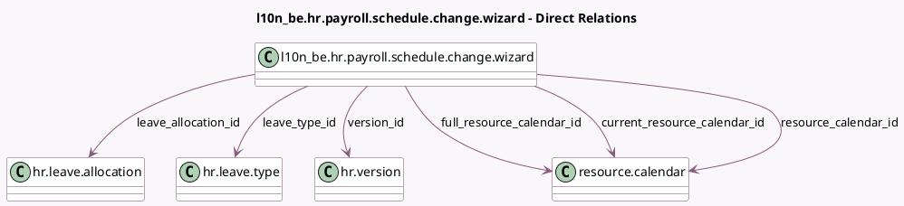

<!-- GENERATED:MODEL -->
---
tags: [odoo, enterprise, generated, model]
---

# l10n_be.hr.payroll.schedule.change.wizard

- Module: [[docs/Enterprise Addons/l10n_be_hr_payroll/l10n_be_hr_payroll|l10n_be_hr_payroll]]
- Scope: Enterprise Addons
- Defined in module: yes
- Source files: `wizard/l10n_be_hr_payroll_schedule_change_wizard.py`
- Python classes: `L10n_BeHrPayrollScheduleChangeWizard`
- Description: Change contract working schedule

## Field footprint

- Detected fields: 22
- Field types: `Boolean` x 3, `Date` x 2, `Float` x 4, `Many2one` x 10, `Monetary` x 3
- Relation fields: 10

## Sample fields

- `company_id`: `Many2one` (related `version_id.company_id`)
- `currency_id`: `Many2one` (related `company_id.currency_id`)
- `current_resource_calendar_id`: `Many2one` (comodel `resource.calendar`, related `version_id.resource_calendar_id`)
- `current_wage`: `Monetary` (comodel `Wage`, compute `_compute_wages`, store `True`)
- `date_end`: `Date` (comodel `End Date`)
- `date_start`: `Date` (comodel `Start Date`)
- `employee_id`: `Many2one` (related `version_id.employee_id`)
- `found_leave_allocation`: `Boolean` (compute `_compute_leave_allocation_id`)
- `full_resource_calendar_id`: `Many2one` (comodel `resource.calendar`, related `structure_type_id.default_resource_calendar_id`)
- `full_time_off_allocation`: `Float` (compute `_compute_full_time_off_allocation`)
- `full_wage`: `Monetary` (comodel `Full Time Equivalent Wage`, compute `_compute_wages`, store `True`)
- `initial_time_off_allocation`: `Float` (compute `_compute_leave_allocation_id`)
- `leave_allocation_id`: `Many2one` (comodel `hr.leave.allocation`, compute `_compute_leave_allocation_id`)
- `leave_type_id`: `Many2one` (comodel `hr.leave.type`)
- `previous_contract_creation`: `Boolean` (comodel `Post Change Contract Creation`)
- `requires_new_contract`: `Boolean` (compute `_compute_requires_new_contract`)
- `resource_calendar_id`: `Many2one` (comodel `resource.calendar`)
- `structure_type_id`: `Many2one` (related `version_id.structure_type_id`)
- `time_off_allocation`: `Float` (compute `_compute_time_off_allocation`, store `True`)
- `version_id`: `Many2one` (comodel `hr.version`)

## Method hints

- Detected methods: 8
- Action methods: `action_validate`
- Compute methods: `_compute_full_time_off_allocation`, `_compute_leave_allocation_id`, `_compute_new_allocation`, `_compute_requires_new_contract`, `_compute_time_off_allocation`, `_compute_wages`
- Onchange methods: none

## Direct relation diagram

## Navigation

- **Parent:** [[docs/Enterprise Addons/l10n_be_hr_payroll/Models]]

<!-- GENERATED:MODEL -->
