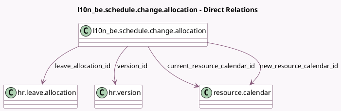

<!-- GENERATED:MODEL -->
---
tags: [odoo, enterprise, generated, model]
---

# l10n_be.schedule.change.allocation

- Module: [[docs/Enterprise Addons/l10n_be_hr_payroll/l10n_be_hr_payroll|l10n_be_hr_payroll]]
- Scope: Enterprise Addons
- Defined in module: yes
- Source files: `models/l10n_be_schedule_change_allocation.py`
- Python classes: `L10n_BeScheduleChangeAllocation`
- Description: Update allocation on schedule change

## Field footprint

- Detected fields: 6
- Field types: `Date` x 1, `Float` x 1, `Many2one` x 4
- Relation fields: 4

## Sample fields

- `current_resource_calendar_id`: `Many2one` (comodel `resource.calendar`)
- `effective_date`: `Date`
- `leave_allocation_id`: `Many2one` (comodel `hr.leave.allocation`)
- `maximum_days`: `Float`
- `new_resource_calendar_id`: `Many2one` (comodel `resource.calendar`)
- `version_id`: `Many2one` (comodel `hr.version`)

## Method hints

- Detected methods: 2
- Action methods: none
- Compute methods: none
- Onchange methods: none

## Direct relation diagram

## Navigation

- **Parent:** [[docs/Enterprise Addons/l10n_be_hr_payroll/Models]]

<!-- GENERATED:MODEL -->
