<!-- GENERATED:MODEL -->
---
tags: [odoo, enterprise, generated, model]
---

# l10n_be.work.entry.daily.benefit.report

- Module: [[docs/Enterprise Addons/l10n_be_hr_payroll/l10n_be_hr_payroll|l10n_be_hr_payroll]]
- Scope: Enterprise Addons
- Defined in module: yes
- Source files: `report/l10n_be_work_entry_daily_benefit.py`
- Python classes: `L10n_BeWorkEntryDailyBenefitReport`
- Description: Work Entry Related Benefit Report

## Field footprint

- Detected fields: 3
- Field types: `Char` x 1, `Date` x 1, `Many2one` x 1
- Relation fields: 1

## Sample fields

- `benefit_name`: `Char` (comodel `Benefit Name`)
- `day`: `Date`
- `employee_id`: `Many2one` (comodel `hr.employee`)

## Method hints

- Detected methods: 1
- Action methods: none
- Compute methods: none
- Onchange methods: none

## Direct relation diagram

```plantuml
@startuml
!define ODOO_COLOR_PRIMARY #714B67
!define ODOO_COLOR_ACCENT #875A7B
!define ODOO_COLOR_BG #FAF7FA

skinparam backgroundColor ODOO_COLOR_BG
skinparam defaultTextAlignment left
skinparam ArrowColor ODOO_COLOR_ACCENT
skinparam ClassBackgroundColor white
skinparam ClassBorderColor ODOO_COLOR_PRIMARY
skinparam ComponentBackgroundColor white
skinparam ComponentBorderColor ODOO_COLOR_PRIMARY
skinparam NoteBackgroundColor #FFF8FF
skinparam NoteBorderColor ODOO_COLOR_ACCENT
skinparam SequenceLifeLineBorderColor ODOO_COLOR_ACCENT
skinparam SequenceLifeLineBackgroundColor #FFFFFF
skinparam SequenceParticipantBorderColor ODOO_COLOR_PRIMARY
skinparam SequenceParticipantBackgroundColor #FFFFFF
skinparam sequence {
  ArrowColor ODOO_COLOR_ACCENT
  ActorBorderColor ODOO_COLOR_PRIMARY
}
title l10n_be.work.entry.daily.benefit.report - Direct Relations
class "l10n_be.work.entry.daily.benefit.report" as l10n_be_work_entry_daily_benefit_report
class "hr.employee" as hr_employee
l10n_be_work_entry_daily_benefit_report --> hr_employee : employee_id
@enduml
```

## Navigation

- **Parent:** [[docs/Enterprise Addons/l10n_be_hr_payroll/Models]]

<!-- GENERATED:MODEL -->
