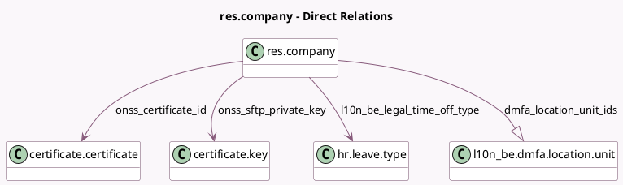

<!-- GENERATED:MODEL -->
---
tags: [odoo, enterprise, generated, model]
---

# res.company

- Module: [[docs/Enterprise Addons/l10n_be_hr_payroll/l10n_be_hr_payroll|l10n_be_hr_payroll]]
- Scope: Enterprise Addons
- Defined in module: extension only
- Source files: `models/res_company.py`
- Python classes: `ResCompany`

## Field footprint

- Detected fields: 14
- Field types: `Char` x 9, `Many2one` x 3, `One2many` x 1, `Selection` x 1
- Relation fields: 4

## Sample fields

- `accident_insurance_name`: `Char`
- `accident_insurance_number`: `Char`
- `dmfa_employer_class`: `Char`
- `dmfa_location_unit_ids`: `One2many` (comodel `l10n_be.dmfa.location.unit`)
- `l10n_be_company_number`: `Char` (comodel `Company Number`)
- `l10n_be_ffe_employer_type`: `Selection`
- `l10n_be_legal_time_off_type`: `Many2one` (comodel `hr.leave.type`)
- `l10n_be_revenue_code`: `Char` (comodel `Revenue Code`)
- `onss_certificate_id`: `Many2one` (comodel `certificate.certificate`)
- `onss_company_id`: `Char`
- `onss_expeditor_number`: `Char`
- `onss_registration_number`: `Char`
- `onss_sftp_private_key`: `Many2one` (comodel `certificate.key`)
- `onss_technical_user_name`: `Char`

## Method hints

- Detected methods: 3
- Action methods: none
- Compute methods: none
- Onchange methods: none

## Direct relation diagram

## Navigation

- **Parent:** [[docs/Enterprise Addons/l10n_be_hr_payroll/Models]]

<!-- GENERATED:MODEL -->
