<!-- GENERATED:MODEL -->
---
tags: [odoo, enterprise, generated, model]
---

# res.config.settings

- Module: [[docs/Enterprise Addons/l10n_be_hr_payroll/l10n_be_hr_payroll|l10n_be_hr_payroll]]
- Scope: Enterprise Addons
- Defined in module: extension only
- Source files: `models/res_config_settings.py`
- Python classes: `ResConfigSettings`

## Field footprint

- Detected fields: 23
- Field types: `Char` x 9, `Float` x 10, `Many2one` x 3, `Selection` x 1
- Relation fields: 3

## Sample fields

- `accident_insurance_name`: `Char` (related `company_id.accident_insurance_name`)
- `accident_insurance_number`: `Char` (related `company_id.accident_insurance_number`)
- `default_commission_on_target`: `Float`
- `default_eco_checks`: `Float`
- `default_fuel_card`: `Float`
- `default_internet`: `Float`
- `default_l10n_be_canteen_cost`: `Float`
- `default_meal_voucher_amount`: `Float`
- `default_mobile`: `Float`
- `default_representation_fees`: `Float`
- `dmfa_employer_class`: `Char` (related `company_id.dmfa_employer_class`)
- `hospital_insurance_amount_adult`: `Float`
- `hospital_insurance_amount_child`: `Float`
- `l10n_be_company_number`: `Char` (comodel `Company Number`, related `company_id.l10n_be_company_number`)
- `l10n_be_ffe_employer_type`: `Selection` (related `company_id.l10n_be_ffe_employer_type`)
- `l10n_be_legal_time_off_type`: `Many2one` (related `company_id.l10n_be_legal_time_off_type`)
- `l10n_be_revenue_code`: `Char` (comodel `Revenue Code`, related `company_id.l10n_be_revenue_code`)
- `onss_certificate_id`: `Many2one` (related `company_id.onss_certificate_id`)
- `onss_company_id`: `Char` (related `company_id.onss_company_id`)
- `onss_expeditor_number`: `Char` (related `company_id.onss_expeditor_number`)

## Method hints

- Detected methods: 0
- Action methods: none
- Compute methods: none
- Onchange methods: none

## Direct relation diagram

```plantuml
@startuml
!define ODOO_COLOR_PRIMARY #714B67
!define ODOO_COLOR_ACCENT #875A7B
!define ODOO_COLOR_BG #FAF7FA

skinparam backgroundColor ODOO_COLOR_BG
skinparam defaultTextAlignment left
skinparam ArrowColor ODOO_COLOR_ACCENT
skinparam ClassBackgroundColor white
skinparam ClassBorderColor ODOO_COLOR_PRIMARY
skinparam ComponentBackgroundColor white
skinparam ComponentBorderColor ODOO_COLOR_PRIMARY
skinparam NoteBackgroundColor #FFF8FF
skinparam NoteBorderColor ODOO_COLOR_ACCENT
skinparam SequenceLifeLineBorderColor ODOO_COLOR_ACCENT
skinparam SequenceLifeLineBackgroundColor #FFFFFF
skinparam SequenceParticipantBorderColor ODOO_COLOR_PRIMARY
skinparam SequenceParticipantBackgroundColor #FFFFFF
skinparam sequence {
  ArrowColor ODOO_COLOR_ACCENT
  ActorBorderColor ODOO_COLOR_PRIMARY
}
title res.config.settings - Direct Relations
class "res.config.settings" as res_config_settings
@enduml
```

## Navigation

- **Parent:** [[docs/Enterprise Addons/l10n_be_hr_payroll/Models]]

<!-- GENERATED:MODEL -->
