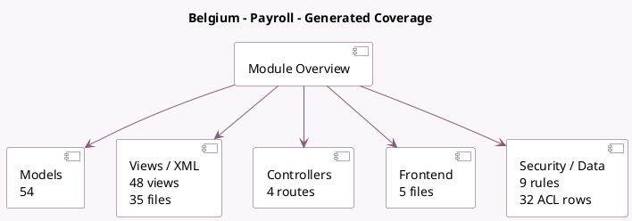

<!-- GENERATED:MODULE -->
---
tags: [odoo, enterprise, module]
---

# Belgium - Payroll

- Scope: Enterprise Addons
- Source: enterprise/l10n_be_hr_payroll
- Dependencies: [[docs/Community Addons/certificate/certificate|certificate]], [[docs/Enterprise Addons/hr_payroll/hr_payroll|hr_payroll]], [[docs/Community Addons/hr_work_entry_holidays/hr_work_entry_holidays|hr_work_entry_holidays]], [[docs/Enterprise Addons/hr_payroll_holidays/hr_payroll_holidays|hr_payroll_holidays]]

## Generated coverage

- Models: 54
- XML files with UI/data artifacts: 35
- Views: 48
- Actions: 43
- Menus: 19
- Rules (ir.rule): 9
- Access CSV entries: 32
- Controller units: 4
- Frontend asset files: 5

## Module map

## Detail notes

- Models: [[docs/Enterprise Addons/l10n_be_hr_payroll/Models|Models]] (54)
- Views and XML: [[docs/Enterprise Addons/l10n_be_hr_payroll/Views|Views]] (35 files)
- Controllers: [[docs/Enterprise Addons/l10n_be_hr_payroll/Controllers|Controllers]] (4)
- Frontend: [[docs/Enterprise Addons/l10n_be_hr_payroll/Frontend|Frontend]] (5 files)

## Key models

- `certificate.certificate`
- `hr.departure.reason`
- `hr.employee`
- `hr.job`
- `hr.leave`
- `hr.leave.allocation`
- `hr.leave.type`
- `hr.payroll.alloc.employee`
- `hr.payroll.alloc.paid.leave`
- `hr.payroll.structure.type`
- `hr.payslip`
- `hr.payslip.employee.depature.holiday.attests`

## Navigation

- [[../Enterprise Addons/Enterprise Addons|Back to scope]]
- [[../../docs/docs|Back to docs]]

<!-- GENERATED:MODULE -->

